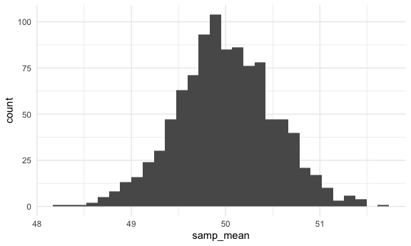
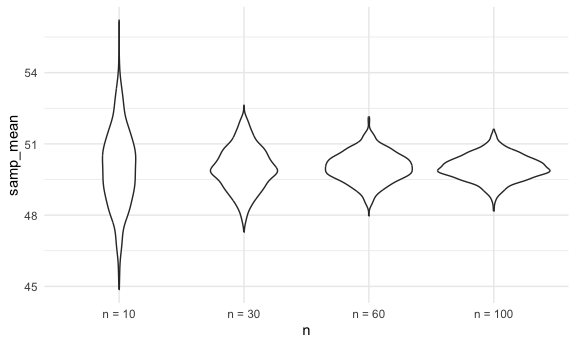
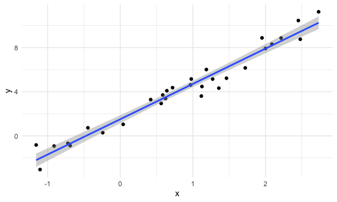
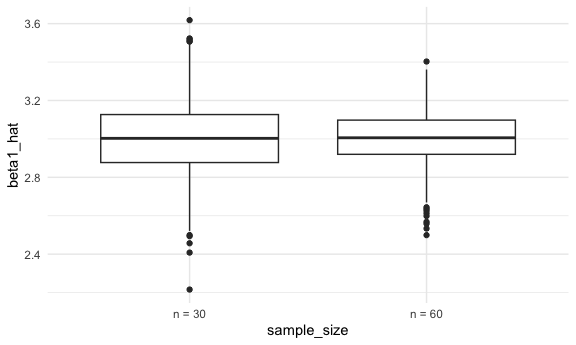
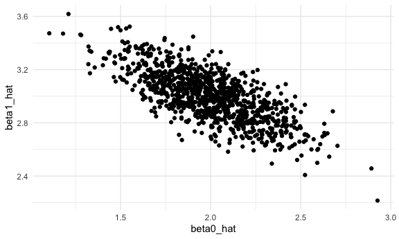
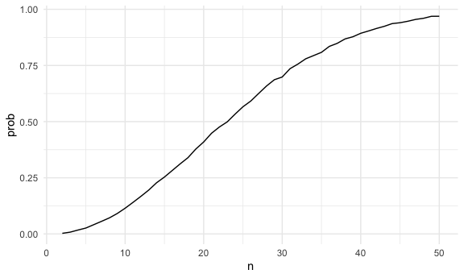

Simulation
================

## Writing a simulation function

``` r
sim_mean_sd = function(samp_size, true_mean = 10, true_sd = 5) {
  
  sim_df = 
  tibble(
    x = rnorm(samp_size, true_mean, true_sd)
  )

out_df = 
  sim_df |> 
  summarize(
    samp_mean = mean(x),
    samp_sd = sd(x)
  )
  
  return(out_df)
}

sim_mean_sd(samp_size = 30, true_mean = 4, true_sd = 12)
```

    ## # A tibble: 1 × 2
    ##   samp_mean samp_sd
    ##       <dbl>   <dbl>
    ## 1      4.33    11.4

``` r
sim_mean_sd(true_mean = 4, true_sd = 12, samp_size = 30)
```

    ## # A tibble: 1 × 2
    ##   samp_mean samp_sd
    ##       <dbl>   <dbl>
    ## 1     -2.29    11.2

``` r
sim_mean_sd(30, 16, 2)
```

    ## # A tibble: 1 × 2
    ##   samp_mean samp_sd
    ##       <dbl>   <dbl>
    ## 1      16.4    1.97

Run this a lot of times…

``` r
sim_mean_sd(30)
```

    ## # A tibble: 1 × 2
    ##   samp_mean samp_sd
    ##       <dbl>   <dbl>
    ## 1      8.58    5.18

Run this using a for loop?

``` r
output = vector("list", 1000)

for(i in 1:1000) {
  
  output[[i]] = sim_mean_sd(30)
}

output
```

    ## [[1]]
    ## # A tibble: 1 × 2
    ##   samp_mean samp_sd
    ##       <dbl>   <dbl>
    ## 1      11.2    3.51
    ## 
    ## [[2]]
    ## # A tibble: 1 × 2
    ##   samp_mean samp_sd
    ##       <dbl>   <dbl>
    ## 1      11.1    5.91
    ## 
    ## [[3]]
    ## # A tibble: 1 × 2
    ##   samp_mean samp_sd
    ##       <dbl>   <dbl>
    ## 1      8.51    5.24
    ## 
    ## [[4]]
    ## # A tibble: 1 × 2
    ##   samp_mean samp_sd
    ##       <dbl>   <dbl>
    ## 1      9.89    3.68
    ## 
    ## [[5]]
    ## # A tibble: 1 × 2
    ##   samp_mean samp_sd
    ##       <dbl>   <dbl>
    ## 1      10.9    4.93
    ## 
    ## [[6]]
    ## # A tibble: 1 × 2
    ##   samp_mean samp_sd
    ##       <dbl>   <dbl>
    ## 1      11.3    5.46
    ## 
    ## [[7]]
    ## # A tibble: 1 × 2
    ##   samp_mean samp_sd
    ##       <dbl>   <dbl>
    ## 1      10.2    5.88
    ## 
    ## [[8]]
    ## # A tibble: 1 × 2
    ##   samp_mean samp_sd
    ##       <dbl>   <dbl>
    ## 1      10.2    5.20
    ## 
    ## [[9]]
    ## # A tibble: 1 × 2
    ##   samp_mean samp_sd
    ##       <dbl>   <dbl>
    ## 1      10.2    5.52
    ## 
    ## [[10]]
    ## # A tibble: 1 × 2
    ##   samp_mean samp_sd
    ##       <dbl>   <dbl>
    ## 1      10.7    5.06
    ## 
    ## [[11]]
    ## # A tibble: 1 × 2
    ##   samp_mean samp_sd
    ##       <dbl>   <dbl>
    ## 1      8.53    4.58
    ## 
    ## [[12]]
    ## # A tibble: 1 × 2
    ##   samp_mean samp_sd
    ##       <dbl>   <dbl>
    ## 1      9.81    4.21
    ## 
    ## [[13]]
    ## # A tibble: 1 × 2
    ##   samp_mean samp_sd
    ##       <dbl>   <dbl>
    ## 1      10.0    5.20
    ## 
    ## [[14]]
    ## # A tibble: 1 × 2
    ##   samp_mean samp_sd
    ##       <dbl>   <dbl>
    ## 1      11.4    4.72
    ## 
    ## [[15]]
    ## # A tibble: 1 × 2
    ##   samp_mean samp_sd
    ##       <dbl>   <dbl>
    ## 1      10.8    5.22
    ## 
    ## [[16]]
    ## # A tibble: 1 × 2
    ##   samp_mean samp_sd
    ##       <dbl>   <dbl>
    ## 1      10.4    5.85
    ## 
    ## [[17]]
    ## # A tibble: 1 × 2
    ##   samp_mean samp_sd
    ##       <dbl>   <dbl>
    ## 1      10.6    4.22
    ## 
    ## [[18]]
    ## # A tibble: 1 × 2
    ##   samp_mean samp_sd
    ##       <dbl>   <dbl>
    ## 1      10.1    4.86
    ## 
    ## [[19]]
    ## # A tibble: 1 × 2
    ##   samp_mean samp_sd
    ##       <dbl>   <dbl>
    ## 1      9.05    4.52
    ## 
    ## [[20]]
    ## # A tibble: 1 × 2
    ##   samp_mean samp_sd
    ##       <dbl>   <dbl>
    ## 1      9.49    4.05
    ## 
    ## [[21]]
    ## # A tibble: 1 × 2
    ##   samp_mean samp_sd
    ##       <dbl>   <dbl>
    ## 1      9.14    4.12
    ## 
    ## [[22]]
    ## # A tibble: 1 × 2
    ##   samp_mean samp_sd
    ##       <dbl>   <dbl>
    ## 1      10.9    3.94
    ## 
    ## [[23]]
    ## # A tibble: 1 × 2
    ##   samp_mean samp_sd
    ##       <dbl>   <dbl>
    ## 1      9.55    4.63
    ## 
    ## [[24]]
    ## # A tibble: 1 × 2
    ##   samp_mean samp_sd
    ##       <dbl>   <dbl>
    ## 1      10.9    5.06
    ## 
    ## [[25]]
    ## # A tibble: 1 × 2
    ##   samp_mean samp_sd
    ##       <dbl>   <dbl>
    ## 1      10.3    4.32
    ## 
    ## [[26]]
    ## # A tibble: 1 × 2
    ##   samp_mean samp_sd
    ##       <dbl>   <dbl>
    ## 1      11.5    6.05
    ## 
    ## [[27]]
    ## # A tibble: 1 × 2
    ##   samp_mean samp_sd
    ##       <dbl>   <dbl>
    ## 1      11.1    5.09
    ## 
    ## [[28]]
    ## # A tibble: 1 × 2
    ##   samp_mean samp_sd
    ##       <dbl>   <dbl>
    ## 1      12.2    3.87
    ## 
    ## [[29]]
    ## # A tibble: 1 × 2
    ##   samp_mean samp_sd
    ##       <dbl>   <dbl>
    ## 1      8.86    4.00
    ## 
    ## [[30]]
    ## # A tibble: 1 × 2
    ##   samp_mean samp_sd
    ##       <dbl>   <dbl>
    ## 1      10.2    4.89
    ## 
    ## [[31]]
    ## # A tibble: 1 × 2
    ##   samp_mean samp_sd
    ##       <dbl>   <dbl>
    ## 1      10.9    5.91
    ## 
    ## [[32]]
    ## # A tibble: 1 × 2
    ##   samp_mean samp_sd
    ##       <dbl>   <dbl>
    ## 1      10.2    4.37
    ## 
    ## [[33]]
    ## # A tibble: 1 × 2
    ##   samp_mean samp_sd
    ##       <dbl>   <dbl>
    ## 1      8.61    4.71
    ## 
    ## [[34]]
    ## # A tibble: 1 × 2
    ##   samp_mean samp_sd
    ##       <dbl>   <dbl>
    ## 1      9.26    4.89
    ## 
    ## [[35]]
    ## # A tibble: 1 × 2
    ##   samp_mean samp_sd
    ##       <dbl>   <dbl>
    ## 1      9.30    4.67
    ## 
    ## [[36]]
    ## # A tibble: 1 × 2
    ##   samp_mean samp_sd
    ##       <dbl>   <dbl>
    ## 1      9.99    6.41
    ## 
    ## [[37]]
    ## # A tibble: 1 × 2
    ##   samp_mean samp_sd
    ##       <dbl>   <dbl>
    ## 1      10.7    4.35
    ## 
    ## [[38]]
    ## # A tibble: 1 × 2
    ##   samp_mean samp_sd
    ##       <dbl>   <dbl>
    ## 1      10.6    4.93
    ## 
    ## [[39]]
    ## # A tibble: 1 × 2
    ##   samp_mean samp_sd
    ##       <dbl>   <dbl>
    ## 1      10.3    5.13
    ## 
    ## [[40]]
    ## # A tibble: 1 × 2
    ##   samp_mean samp_sd
    ##       <dbl>   <dbl>
    ## 1      10.1    4.32
    ## 
    ## [[41]]
    ## # A tibble: 1 × 2
    ##   samp_mean samp_sd
    ##       <dbl>   <dbl>
    ## 1      10.2    5.84
    ## 
    ## [[42]]
    ## # A tibble: 1 × 2
    ##   samp_mean samp_sd
    ##       <dbl>   <dbl>
    ## 1      9.61    5.01
    ## 
    ## [[43]]
    ## # A tibble: 1 × 2
    ##   samp_mean samp_sd
    ##       <dbl>   <dbl>
    ## 1      10.7    4.13
    ## 
    ## [[44]]
    ## # A tibble: 1 × 2
    ##   samp_mean samp_sd
    ##       <dbl>   <dbl>
    ## 1      8.47    5.64
    ## 
    ## [[45]]
    ## # A tibble: 1 × 2
    ##   samp_mean samp_sd
    ##       <dbl>   <dbl>
    ## 1      9.70    4.83
    ## 
    ## [[46]]
    ## # A tibble: 1 × 2
    ##   samp_mean samp_sd
    ##       <dbl>   <dbl>
    ## 1      9.12    5.34
    ## 
    ## [[47]]
    ## # A tibble: 1 × 2
    ##   samp_mean samp_sd
    ##       <dbl>   <dbl>
    ## 1      10.1    4.24
    ## 
    ## [[48]]
    ## # A tibble: 1 × 2
    ##   samp_mean samp_sd
    ##       <dbl>   <dbl>
    ## 1      10.7    5.07
    ## 
    ## [[49]]
    ## # A tibble: 1 × 2
    ##   samp_mean samp_sd
    ##       <dbl>   <dbl>
    ## 1      9.43    5.80
    ## 
    ## [[50]]
    ## # A tibble: 1 × 2
    ##   samp_mean samp_sd
    ##       <dbl>   <dbl>
    ## 1      12.0    4.88
    ## 
    ## [[51]]
    ## # A tibble: 1 × 2
    ##   samp_mean samp_sd
    ##       <dbl>   <dbl>
    ## 1      10.0    5.72
    ## 
    ## [[52]]
    ## # A tibble: 1 × 2
    ##   samp_mean samp_sd
    ##       <dbl>   <dbl>
    ## 1      10.7    4.54
    ## 
    ## [[53]]
    ## # A tibble: 1 × 2
    ##   samp_mean samp_sd
    ##       <dbl>   <dbl>
    ## 1      8.55    5.40
    ## 
    ## [[54]]
    ## # A tibble: 1 × 2
    ##   samp_mean samp_sd
    ##       <dbl>   <dbl>
    ## 1      9.58    3.58
    ## 
    ## [[55]]
    ## # A tibble: 1 × 2
    ##   samp_mean samp_sd
    ##       <dbl>   <dbl>
    ## 1      9.61    5.63
    ## 
    ## [[56]]
    ## # A tibble: 1 × 2
    ##   samp_mean samp_sd
    ##       <dbl>   <dbl>
    ## 1      9.32    4.64
    ## 
    ## [[57]]
    ## # A tibble: 1 × 2
    ##   samp_mean samp_sd
    ##       <dbl>   <dbl>
    ## 1      10.2    4.94
    ## 
    ## [[58]]
    ## # A tibble: 1 × 2
    ##   samp_mean samp_sd
    ##       <dbl>   <dbl>
    ## 1      9.66    4.18
    ## 
    ## [[59]]
    ## # A tibble: 1 × 2
    ##   samp_mean samp_sd
    ##       <dbl>   <dbl>
    ## 1      10.1    5.08
    ## 
    ## [[60]]
    ## # A tibble: 1 × 2
    ##   samp_mean samp_sd
    ##       <dbl>   <dbl>
    ## 1      11.2    5.17
    ## 
    ## [[61]]
    ## # A tibble: 1 × 2
    ##   samp_mean samp_sd
    ##       <dbl>   <dbl>
    ## 1      10.3    5.00
    ## 
    ## [[62]]
    ## # A tibble: 1 × 2
    ##   samp_mean samp_sd
    ##       <dbl>   <dbl>
    ## 1      11.7    5.23
    ## 
    ## [[63]]
    ## # A tibble: 1 × 2
    ##   samp_mean samp_sd
    ##       <dbl>   <dbl>
    ## 1      9.27    5.12
    ## 
    ## [[64]]
    ## # A tibble: 1 × 2
    ##   samp_mean samp_sd
    ##       <dbl>   <dbl>
    ## 1      9.56    5.69
    ## 
    ## [[65]]
    ## # A tibble: 1 × 2
    ##   samp_mean samp_sd
    ##       <dbl>   <dbl>
    ## 1      10.9    5.99
    ## 
    ## [[66]]
    ## # A tibble: 1 × 2
    ##   samp_mean samp_sd
    ##       <dbl>   <dbl>
    ## 1      10.3    4.68
    ## 
    ## [[67]]
    ## # A tibble: 1 × 2
    ##   samp_mean samp_sd
    ##       <dbl>   <dbl>
    ## 1      8.12    5.64
    ## 
    ## [[68]]
    ## # A tibble: 1 × 2
    ##   samp_mean samp_sd
    ##       <dbl>   <dbl>
    ## 1      10.1    4.41
    ## 
    ## [[69]]
    ## # A tibble: 1 × 2
    ##   samp_mean samp_sd
    ##       <dbl>   <dbl>
    ## 1      8.48    5.55
    ## 
    ## [[70]]
    ## # A tibble: 1 × 2
    ##   samp_mean samp_sd
    ##       <dbl>   <dbl>
    ## 1      9.95    4.98
    ## 
    ## [[71]]
    ## # A tibble: 1 × 2
    ##   samp_mean samp_sd
    ##       <dbl>   <dbl>
    ## 1      9.19    4.60
    ## 
    ## [[72]]
    ## # A tibble: 1 × 2
    ##   samp_mean samp_sd
    ##       <dbl>   <dbl>
    ## 1      8.83    5.04
    ## 
    ## [[73]]
    ## # A tibble: 1 × 2
    ##   samp_mean samp_sd
    ##       <dbl>   <dbl>
    ## 1      10.6    4.49
    ## 
    ## [[74]]
    ## # A tibble: 1 × 2
    ##   samp_mean samp_sd
    ##       <dbl>   <dbl>
    ## 1      9.93    4.38
    ## 
    ## [[75]]
    ## # A tibble: 1 × 2
    ##   samp_mean samp_sd
    ##       <dbl>   <dbl>
    ## 1      9.98    4.31
    ## 
    ## [[76]]
    ## # A tibble: 1 × 2
    ##   samp_mean samp_sd
    ##       <dbl>   <dbl>
    ## 1      10.4    4.76
    ## 
    ## [[77]]
    ## # A tibble: 1 × 2
    ##   samp_mean samp_sd
    ##       <dbl>   <dbl>
    ## 1      8.78    5.07
    ## 
    ## [[78]]
    ## # A tibble: 1 × 2
    ##   samp_mean samp_sd
    ##       <dbl>   <dbl>
    ## 1      11.0    3.65
    ## 
    ## [[79]]
    ## # A tibble: 1 × 2
    ##   samp_mean samp_sd
    ##       <dbl>   <dbl>
    ## 1      11.1    4.49
    ## 
    ## [[80]]
    ## # A tibble: 1 × 2
    ##   samp_mean samp_sd
    ##       <dbl>   <dbl>
    ## 1      8.99    5.18
    ## 
    ## [[81]]
    ## # A tibble: 1 × 2
    ##   samp_mean samp_sd
    ##       <dbl>   <dbl>
    ## 1      9.84    5.37
    ## 
    ## [[82]]
    ## # A tibble: 1 × 2
    ##   samp_mean samp_sd
    ##       <dbl>   <dbl>
    ## 1      10.5    4.43
    ## 
    ## [[83]]
    ## # A tibble: 1 × 2
    ##   samp_mean samp_sd
    ##       <dbl>   <dbl>
    ## 1      9.86    6.90
    ## 
    ## [[84]]
    ## # A tibble: 1 × 2
    ##   samp_mean samp_sd
    ##       <dbl>   <dbl>
    ## 1      9.42    4.89
    ## 
    ## [[85]]
    ## # A tibble: 1 × 2
    ##   samp_mean samp_sd
    ##       <dbl>   <dbl>
    ## 1      10.7    4.74
    ## 
    ## [[86]]
    ## # A tibble: 1 × 2
    ##   samp_mean samp_sd
    ##       <dbl>   <dbl>
    ## 1      8.40    5.00
    ## 
    ## [[87]]
    ## # A tibble: 1 × 2
    ##   samp_mean samp_sd
    ##       <dbl>   <dbl>
    ## 1      9.22    5.62
    ## 
    ## [[88]]
    ## # A tibble: 1 × 2
    ##   samp_mean samp_sd
    ##       <dbl>   <dbl>
    ## 1      9.35    5.57
    ## 
    ## [[89]]
    ## # A tibble: 1 × 2
    ##   samp_mean samp_sd
    ##       <dbl>   <dbl>
    ## 1      10.9    5.22
    ## 
    ## [[90]]
    ## # A tibble: 1 × 2
    ##   samp_mean samp_sd
    ##       <dbl>   <dbl>
    ## 1      10.0    4.55
    ## 
    ## [[91]]
    ## # A tibble: 1 × 2
    ##   samp_mean samp_sd
    ##       <dbl>   <dbl>
    ## 1      8.52    5.45
    ## 
    ## [[92]]
    ## # A tibble: 1 × 2
    ##   samp_mean samp_sd
    ##       <dbl>   <dbl>
    ## 1      10.3    5.37
    ## 
    ## [[93]]
    ## # A tibble: 1 × 2
    ##   samp_mean samp_sd
    ##       <dbl>   <dbl>
    ## 1      10.3    5.41
    ## 
    ## [[94]]
    ## # A tibble: 1 × 2
    ##   samp_mean samp_sd
    ##       <dbl>   <dbl>
    ## 1      10.1    5.27
    ## 
    ## [[95]]
    ## # A tibble: 1 × 2
    ##   samp_mean samp_sd
    ##       <dbl>   <dbl>
    ## 1      10.2    5.19
    ## 
    ## [[96]]
    ## # A tibble: 1 × 2
    ##   samp_mean samp_sd
    ##       <dbl>   <dbl>
    ## 1      9.68    4.57
    ## 
    ## [[97]]
    ## # A tibble: 1 × 2
    ##   samp_mean samp_sd
    ##       <dbl>   <dbl>
    ## 1      10.3    4.82
    ## 
    ## [[98]]
    ## # A tibble: 1 × 2
    ##   samp_mean samp_sd
    ##       <dbl>   <dbl>
    ## 1      7.70    4.28
    ## 
    ## [[99]]
    ## # A tibble: 1 × 2
    ##   samp_mean samp_sd
    ##       <dbl>   <dbl>
    ## 1      9.25    4.42
    ## 
    ## [[100]]
    ## # A tibble: 1 × 2
    ##   samp_mean samp_sd
    ##       <dbl>   <dbl>
    ## 1      8.78    6.02
    ## 
    ## [[101]]
    ## # A tibble: 1 × 2
    ##   samp_mean samp_sd
    ##       <dbl>   <dbl>
    ## 1      8.53    5.84
    ## 
    ## [[102]]
    ## # A tibble: 1 × 2
    ##   samp_mean samp_sd
    ##       <dbl>   <dbl>
    ## 1      9.75    3.72
    ## 
    ## [[103]]
    ## # A tibble: 1 × 2
    ##   samp_mean samp_sd
    ##       <dbl>   <dbl>
    ## 1      9.26    4.11
    ## 
    ## [[104]]
    ## # A tibble: 1 × 2
    ##   samp_mean samp_sd
    ##       <dbl>   <dbl>
    ## 1      9.51    6.13
    ## 
    ## [[105]]
    ## # A tibble: 1 × 2
    ##   samp_mean samp_sd
    ##       <dbl>   <dbl>
    ## 1      9.76    5.70
    ## 
    ## [[106]]
    ## # A tibble: 1 × 2
    ##   samp_mean samp_sd
    ##       <dbl>   <dbl>
    ## 1      11.6    5.12
    ## 
    ## [[107]]
    ## # A tibble: 1 × 2
    ##   samp_mean samp_sd
    ##       <dbl>   <dbl>
    ## 1      10.7    5.52
    ## 
    ## [[108]]
    ## # A tibble: 1 × 2
    ##   samp_mean samp_sd
    ##       <dbl>   <dbl>
    ## 1      9.55    3.91
    ## 
    ## [[109]]
    ## # A tibble: 1 × 2
    ##   samp_mean samp_sd
    ##       <dbl>   <dbl>
    ## 1      9.81    6.31
    ## 
    ## [[110]]
    ## # A tibble: 1 × 2
    ##   samp_mean samp_sd
    ##       <dbl>   <dbl>
    ## 1      9.72    4.25
    ## 
    ## [[111]]
    ## # A tibble: 1 × 2
    ##   samp_mean samp_sd
    ##       <dbl>   <dbl>
    ## 1      8.70    6.12
    ## 
    ## [[112]]
    ## # A tibble: 1 × 2
    ##   samp_mean samp_sd
    ##       <dbl>   <dbl>
    ## 1      9.10    4.99
    ## 
    ## [[113]]
    ## # A tibble: 1 × 2
    ##   samp_mean samp_sd
    ##       <dbl>   <dbl>
    ## 1      9.80    4.64
    ## 
    ## [[114]]
    ## # A tibble: 1 × 2
    ##   samp_mean samp_sd
    ##       <dbl>   <dbl>
    ## 1      11.5    3.40
    ## 
    ## [[115]]
    ## # A tibble: 1 × 2
    ##   samp_mean samp_sd
    ##       <dbl>   <dbl>
    ## 1      9.92    4.95
    ## 
    ## [[116]]
    ## # A tibble: 1 × 2
    ##   samp_mean samp_sd
    ##       <dbl>   <dbl>
    ## 1      9.73    5.69
    ## 
    ## [[117]]
    ## # A tibble: 1 × 2
    ##   samp_mean samp_sd
    ##       <dbl>   <dbl>
    ## 1      8.39    5.99
    ## 
    ## [[118]]
    ## # A tibble: 1 × 2
    ##   samp_mean samp_sd
    ##       <dbl>   <dbl>
    ## 1      11.2    5.89
    ## 
    ## [[119]]
    ## # A tibble: 1 × 2
    ##   samp_mean samp_sd
    ##       <dbl>   <dbl>
    ## 1      9.19    4.85
    ## 
    ## [[120]]
    ## # A tibble: 1 × 2
    ##   samp_mean samp_sd
    ##       <dbl>   <dbl>
    ## 1      10.2    5.47
    ## 
    ## [[121]]
    ## # A tibble: 1 × 2
    ##   samp_mean samp_sd
    ##       <dbl>   <dbl>
    ## 1      8.79    4.61
    ## 
    ## [[122]]
    ## # A tibble: 1 × 2
    ##   samp_mean samp_sd
    ##       <dbl>   <dbl>
    ## 1      10.7    6.10
    ## 
    ## [[123]]
    ## # A tibble: 1 × 2
    ##   samp_mean samp_sd
    ##       <dbl>   <dbl>
    ## 1      11.8    5.74
    ## 
    ## [[124]]
    ## # A tibble: 1 × 2
    ##   samp_mean samp_sd
    ##       <dbl>   <dbl>
    ## 1      10.7    4.38
    ## 
    ## [[125]]
    ## # A tibble: 1 × 2
    ##   samp_mean samp_sd
    ##       <dbl>   <dbl>
    ## 1      9.43    4.71
    ## 
    ## [[126]]
    ## # A tibble: 1 × 2
    ##   samp_mean samp_sd
    ##       <dbl>   <dbl>
    ## 1      7.97    4.59
    ## 
    ## [[127]]
    ## # A tibble: 1 × 2
    ##   samp_mean samp_sd
    ##       <dbl>   <dbl>
    ## 1      10.5    5.27
    ## 
    ## [[128]]
    ## # A tibble: 1 × 2
    ##   samp_mean samp_sd
    ##       <dbl>   <dbl>
    ## 1      10.1    5.33
    ## 
    ## [[129]]
    ## # A tibble: 1 × 2
    ##   samp_mean samp_sd
    ##       <dbl>   <dbl>
    ## 1      9.77    4.16
    ## 
    ## [[130]]
    ## # A tibble: 1 × 2
    ##   samp_mean samp_sd
    ##       <dbl>   <dbl>
    ## 1      11.7    4.34
    ## 
    ## [[131]]
    ## # A tibble: 1 × 2
    ##   samp_mean samp_sd
    ##       <dbl>   <dbl>
    ## 1      8.55    6.24
    ## 
    ## [[132]]
    ## # A tibble: 1 × 2
    ##   samp_mean samp_sd
    ##       <dbl>   <dbl>
    ## 1      10.7    4.32
    ## 
    ## [[133]]
    ## # A tibble: 1 × 2
    ##   samp_mean samp_sd
    ##       <dbl>   <dbl>
    ## 1      8.97    3.54
    ## 
    ## [[134]]
    ## # A tibble: 1 × 2
    ##   samp_mean samp_sd
    ##       <dbl>   <dbl>
    ## 1      8.08    4.71
    ## 
    ## [[135]]
    ## # A tibble: 1 × 2
    ##   samp_mean samp_sd
    ##       <dbl>   <dbl>
    ## 1      8.79    4.72
    ## 
    ## [[136]]
    ## # A tibble: 1 × 2
    ##   samp_mean samp_sd
    ##       <dbl>   <dbl>
    ## 1      9.53    5.23
    ## 
    ## [[137]]
    ## # A tibble: 1 × 2
    ##   samp_mean samp_sd
    ##       <dbl>   <dbl>
    ## 1      8.80    4.09
    ## 
    ## [[138]]
    ## # A tibble: 1 × 2
    ##   samp_mean samp_sd
    ##       <dbl>   <dbl>
    ## 1      9.50    5.63
    ## 
    ## [[139]]
    ## # A tibble: 1 × 2
    ##   samp_mean samp_sd
    ##       <dbl>   <dbl>
    ## 1      9.98    4.33
    ## 
    ## [[140]]
    ## # A tibble: 1 × 2
    ##   samp_mean samp_sd
    ##       <dbl>   <dbl>
    ## 1      9.07    3.96
    ## 
    ## [[141]]
    ## # A tibble: 1 × 2
    ##   samp_mean samp_sd
    ##       <dbl>   <dbl>
    ## 1      9.56    5.08
    ## 
    ## [[142]]
    ## # A tibble: 1 × 2
    ##   samp_mean samp_sd
    ##       <dbl>   <dbl>
    ## 1      10.2    5.93
    ## 
    ## [[143]]
    ## # A tibble: 1 × 2
    ##   samp_mean samp_sd
    ##       <dbl>   <dbl>
    ## 1      10.9    4.65
    ## 
    ## [[144]]
    ## # A tibble: 1 × 2
    ##   samp_mean samp_sd
    ##       <dbl>   <dbl>
    ## 1      9.56    4.76
    ## 
    ## [[145]]
    ## # A tibble: 1 × 2
    ##   samp_mean samp_sd
    ##       <dbl>   <dbl>
    ## 1      10.8    3.40
    ## 
    ## [[146]]
    ## # A tibble: 1 × 2
    ##   samp_mean samp_sd
    ##       <dbl>   <dbl>
    ## 1      9.70    5.74
    ## 
    ## [[147]]
    ## # A tibble: 1 × 2
    ##   samp_mean samp_sd
    ##       <dbl>   <dbl>
    ## 1      10.5    4.50
    ## 
    ## [[148]]
    ## # A tibble: 1 × 2
    ##   samp_mean samp_sd
    ##       <dbl>   <dbl>
    ## 1      9.43    3.97
    ## 
    ## [[149]]
    ## # A tibble: 1 × 2
    ##   samp_mean samp_sd
    ##       <dbl>   <dbl>
    ## 1      8.87    5.04
    ## 
    ## [[150]]
    ## # A tibble: 1 × 2
    ##   samp_mean samp_sd
    ##       <dbl>   <dbl>
    ## 1      11.3    4.94
    ## 
    ## [[151]]
    ## # A tibble: 1 × 2
    ##   samp_mean samp_sd
    ##       <dbl>   <dbl>
    ## 1      8.67    4.64
    ## 
    ## [[152]]
    ## # A tibble: 1 × 2
    ##   samp_mean samp_sd
    ##       <dbl>   <dbl>
    ## 1      8.96    6.07
    ## 
    ## [[153]]
    ## # A tibble: 1 × 2
    ##   samp_mean samp_sd
    ##       <dbl>   <dbl>
    ## 1      9.16    4.31
    ## 
    ## [[154]]
    ## # A tibble: 1 × 2
    ##   samp_mean samp_sd
    ##       <dbl>   <dbl>
    ## 1      10.5    4.06
    ## 
    ## [[155]]
    ## # A tibble: 1 × 2
    ##   samp_mean samp_sd
    ##       <dbl>   <dbl>
    ## 1      10.2    4.94
    ## 
    ## [[156]]
    ## # A tibble: 1 × 2
    ##   samp_mean samp_sd
    ##       <dbl>   <dbl>
    ## 1      10.6    3.55
    ## 
    ## [[157]]
    ## # A tibble: 1 × 2
    ##   samp_mean samp_sd
    ##       <dbl>   <dbl>
    ## 1      10.1    4.83
    ## 
    ## [[158]]
    ## # A tibble: 1 × 2
    ##   samp_mean samp_sd
    ##       <dbl>   <dbl>
    ## 1      10.6    5.59
    ## 
    ## [[159]]
    ## # A tibble: 1 × 2
    ##   samp_mean samp_sd
    ##       <dbl>   <dbl>
    ## 1      9.24    5.06
    ## 
    ## [[160]]
    ## # A tibble: 1 × 2
    ##   samp_mean samp_sd
    ##       <dbl>   <dbl>
    ## 1      11.0    4.86
    ## 
    ## [[161]]
    ## # A tibble: 1 × 2
    ##   samp_mean samp_sd
    ##       <dbl>   <dbl>
    ## 1      8.97    4.69
    ## 
    ## [[162]]
    ## # A tibble: 1 × 2
    ##   samp_mean samp_sd
    ##       <dbl>   <dbl>
    ## 1      10.5    4.30
    ## 
    ## [[163]]
    ## # A tibble: 1 × 2
    ##   samp_mean samp_sd
    ##       <dbl>   <dbl>
    ## 1      9.81    5.05
    ## 
    ## [[164]]
    ## # A tibble: 1 × 2
    ##   samp_mean samp_sd
    ##       <dbl>   <dbl>
    ## 1      10.9    3.51
    ## 
    ## [[165]]
    ## # A tibble: 1 × 2
    ##   samp_mean samp_sd
    ##       <dbl>   <dbl>
    ## 1      9.20    5.51
    ## 
    ## [[166]]
    ## # A tibble: 1 × 2
    ##   samp_mean samp_sd
    ##       <dbl>   <dbl>
    ## 1      9.81    5.07
    ## 
    ## [[167]]
    ## # A tibble: 1 × 2
    ##   samp_mean samp_sd
    ##       <dbl>   <dbl>
    ## 1      10.3    4.87
    ## 
    ## [[168]]
    ## # A tibble: 1 × 2
    ##   samp_mean samp_sd
    ##       <dbl>   <dbl>
    ## 1      11.3    5.07
    ## 
    ## [[169]]
    ## # A tibble: 1 × 2
    ##   samp_mean samp_sd
    ##       <dbl>   <dbl>
    ## 1      9.13    5.53
    ## 
    ## [[170]]
    ## # A tibble: 1 × 2
    ##   samp_mean samp_sd
    ##       <dbl>   <dbl>
    ## 1      10.2    5.84
    ## 
    ## [[171]]
    ## # A tibble: 1 × 2
    ##   samp_mean samp_sd
    ##       <dbl>   <dbl>
    ## 1      9.18    4.29
    ## 
    ## [[172]]
    ## # A tibble: 1 × 2
    ##   samp_mean samp_sd
    ##       <dbl>   <dbl>
    ## 1      9.91    5.69
    ## 
    ## [[173]]
    ## # A tibble: 1 × 2
    ##   samp_mean samp_sd
    ##       <dbl>   <dbl>
    ## 1      9.46    4.81
    ## 
    ## [[174]]
    ## # A tibble: 1 × 2
    ##   samp_mean samp_sd
    ##       <dbl>   <dbl>
    ## 1      10.2    4.60
    ## 
    ## [[175]]
    ## # A tibble: 1 × 2
    ##   samp_mean samp_sd
    ##       <dbl>   <dbl>
    ## 1      9.75    5.42
    ## 
    ## [[176]]
    ## # A tibble: 1 × 2
    ##   samp_mean samp_sd
    ##       <dbl>   <dbl>
    ## 1      10.2    5.12
    ## 
    ## [[177]]
    ## # A tibble: 1 × 2
    ##   samp_mean samp_sd
    ##       <dbl>   <dbl>
    ## 1      10.0    5.00
    ## 
    ## [[178]]
    ## # A tibble: 1 × 2
    ##   samp_mean samp_sd
    ##       <dbl>   <dbl>
    ## 1      10.2    4.32
    ## 
    ## [[179]]
    ## # A tibble: 1 × 2
    ##   samp_mean samp_sd
    ##       <dbl>   <dbl>
    ## 1      8.63    5.76
    ## 
    ## [[180]]
    ## # A tibble: 1 × 2
    ##   samp_mean samp_sd
    ##       <dbl>   <dbl>
    ## 1      9.26    4.49
    ## 
    ## [[181]]
    ## # A tibble: 1 × 2
    ##   samp_mean samp_sd
    ##       <dbl>   <dbl>
    ## 1      11.8    5.10
    ## 
    ## [[182]]
    ## # A tibble: 1 × 2
    ##   samp_mean samp_sd
    ##       <dbl>   <dbl>
    ## 1      11.3    3.63
    ## 
    ## [[183]]
    ## # A tibble: 1 × 2
    ##   samp_mean samp_sd
    ##       <dbl>   <dbl>
    ## 1      9.97    5.24
    ## 
    ## [[184]]
    ## # A tibble: 1 × 2
    ##   samp_mean samp_sd
    ##       <dbl>   <dbl>
    ## 1      9.02    4.74
    ## 
    ## [[185]]
    ## # A tibble: 1 × 2
    ##   samp_mean samp_sd
    ##       <dbl>   <dbl>
    ## 1      9.50    4.99
    ## 
    ## [[186]]
    ## # A tibble: 1 × 2
    ##   samp_mean samp_sd
    ##       <dbl>   <dbl>
    ## 1      11.4    5.80
    ## 
    ## [[187]]
    ## # A tibble: 1 × 2
    ##   samp_mean samp_sd
    ##       <dbl>   <dbl>
    ## 1      8.11    4.82
    ## 
    ## [[188]]
    ## # A tibble: 1 × 2
    ##   samp_mean samp_sd
    ##       <dbl>   <dbl>
    ## 1      10.9    6.72
    ## 
    ## [[189]]
    ## # A tibble: 1 × 2
    ##   samp_mean samp_sd
    ##       <dbl>   <dbl>
    ## 1      7.61    6.27
    ## 
    ## [[190]]
    ## # A tibble: 1 × 2
    ##   samp_mean samp_sd
    ##       <dbl>   <dbl>
    ## 1      10.0    4.24
    ## 
    ## [[191]]
    ## # A tibble: 1 × 2
    ##   samp_mean samp_sd
    ##       <dbl>   <dbl>
    ## 1      10.5    4.03
    ## 
    ## [[192]]
    ## # A tibble: 1 × 2
    ##   samp_mean samp_sd
    ##       <dbl>   <dbl>
    ## 1      9.09    4.94
    ## 
    ## [[193]]
    ## # A tibble: 1 × 2
    ##   samp_mean samp_sd
    ##       <dbl>   <dbl>
    ## 1      8.37    6.38
    ## 
    ## [[194]]
    ## # A tibble: 1 × 2
    ##   samp_mean samp_sd
    ##       <dbl>   <dbl>
    ## 1      11.7    4.25
    ## 
    ## [[195]]
    ## # A tibble: 1 × 2
    ##   samp_mean samp_sd
    ##       <dbl>   <dbl>
    ## 1      9.52    5.70
    ## 
    ## [[196]]
    ## # A tibble: 1 × 2
    ##   samp_mean samp_sd
    ##       <dbl>   <dbl>
    ## 1      10.9    5.72
    ## 
    ## [[197]]
    ## # A tibble: 1 × 2
    ##   samp_mean samp_sd
    ##       <dbl>   <dbl>
    ## 1      11.7    5.26
    ## 
    ## [[198]]
    ## # A tibble: 1 × 2
    ##   samp_mean samp_sd
    ##       <dbl>   <dbl>
    ## 1      9.90    5.39
    ## 
    ## [[199]]
    ## # A tibble: 1 × 2
    ##   samp_mean samp_sd
    ##       <dbl>   <dbl>
    ## 1      10.5    4.98
    ## 
    ## [[200]]
    ## # A tibble: 1 × 2
    ##   samp_mean samp_sd
    ##       <dbl>   <dbl>
    ## 1      10.6    4.81
    ## 
    ## [[201]]
    ## # A tibble: 1 × 2
    ##   samp_mean samp_sd
    ##       <dbl>   <dbl>
    ## 1      8.47    4.49
    ## 
    ## [[202]]
    ## # A tibble: 1 × 2
    ##   samp_mean samp_sd
    ##       <dbl>   <dbl>
    ## 1      10.1    5.32
    ## 
    ## [[203]]
    ## # A tibble: 1 × 2
    ##   samp_mean samp_sd
    ##       <dbl>   <dbl>
    ## 1      8.49    5.10
    ## 
    ## [[204]]
    ## # A tibble: 1 × 2
    ##   samp_mean samp_sd
    ##       <dbl>   <dbl>
    ## 1      10.3    5.26
    ## 
    ## [[205]]
    ## # A tibble: 1 × 2
    ##   samp_mean samp_sd
    ##       <dbl>   <dbl>
    ## 1      10.3    5.80
    ## 
    ## [[206]]
    ## # A tibble: 1 × 2
    ##   samp_mean samp_sd
    ##       <dbl>   <dbl>
    ## 1      9.47    5.87
    ## 
    ## [[207]]
    ## # A tibble: 1 × 2
    ##   samp_mean samp_sd
    ##       <dbl>   <dbl>
    ## 1      10.8    4.62
    ## 
    ## [[208]]
    ## # A tibble: 1 × 2
    ##   samp_mean samp_sd
    ##       <dbl>   <dbl>
    ## 1      10.0    5.11
    ## 
    ## [[209]]
    ## # A tibble: 1 × 2
    ##   samp_mean samp_sd
    ##       <dbl>   <dbl>
    ## 1      8.91    4.61
    ## 
    ## [[210]]
    ## # A tibble: 1 × 2
    ##   samp_mean samp_sd
    ##       <dbl>   <dbl>
    ## 1      10.7    4.98
    ## 
    ## [[211]]
    ## # A tibble: 1 × 2
    ##   samp_mean samp_sd
    ##       <dbl>   <dbl>
    ## 1      10.4    4.81
    ## 
    ## [[212]]
    ## # A tibble: 1 × 2
    ##   samp_mean samp_sd
    ##       <dbl>   <dbl>
    ## 1      12.2    5.31
    ## 
    ## [[213]]
    ## # A tibble: 1 × 2
    ##   samp_mean samp_sd
    ##       <dbl>   <dbl>
    ## 1      7.97    3.95
    ## 
    ## [[214]]
    ## # A tibble: 1 × 2
    ##   samp_mean samp_sd
    ##       <dbl>   <dbl>
    ## 1      10.5    3.69
    ## 
    ## [[215]]
    ## # A tibble: 1 × 2
    ##   samp_mean samp_sd
    ##       <dbl>   <dbl>
    ## 1      9.69    4.28
    ## 
    ## [[216]]
    ## # A tibble: 1 × 2
    ##   samp_mean samp_sd
    ##       <dbl>   <dbl>
    ## 1      8.48    4.70
    ## 
    ## [[217]]
    ## # A tibble: 1 × 2
    ##   samp_mean samp_sd
    ##       <dbl>   <dbl>
    ## 1      10.8    3.97
    ## 
    ## [[218]]
    ## # A tibble: 1 × 2
    ##   samp_mean samp_sd
    ##       <dbl>   <dbl>
    ## 1      9.25    5.05
    ## 
    ## [[219]]
    ## # A tibble: 1 × 2
    ##   samp_mean samp_sd
    ##       <dbl>   <dbl>
    ## 1      9.21    4.75
    ## 
    ## [[220]]
    ## # A tibble: 1 × 2
    ##   samp_mean samp_sd
    ##       <dbl>   <dbl>
    ## 1      8.28    4.19
    ## 
    ## [[221]]
    ## # A tibble: 1 × 2
    ##   samp_mean samp_sd
    ##       <dbl>   <dbl>
    ## 1      9.35    4.11
    ## 
    ## [[222]]
    ## # A tibble: 1 × 2
    ##   samp_mean samp_sd
    ##       <dbl>   <dbl>
    ## 1      11.1    4.06
    ## 
    ## [[223]]
    ## # A tibble: 1 × 2
    ##   samp_mean samp_sd
    ##       <dbl>   <dbl>
    ## 1      12.0    4.78
    ## 
    ## [[224]]
    ## # A tibble: 1 × 2
    ##   samp_mean samp_sd
    ##       <dbl>   <dbl>
    ## 1      9.48    5.24
    ## 
    ## [[225]]
    ## # A tibble: 1 × 2
    ##   samp_mean samp_sd
    ##       <dbl>   <dbl>
    ## 1      10.2    4.75
    ## 
    ## [[226]]
    ## # A tibble: 1 × 2
    ##   samp_mean samp_sd
    ##       <dbl>   <dbl>
    ## 1      10.1    5.23
    ## 
    ## [[227]]
    ## # A tibble: 1 × 2
    ##   samp_mean samp_sd
    ##       <dbl>   <dbl>
    ## 1      9.65    4.16
    ## 
    ## [[228]]
    ## # A tibble: 1 × 2
    ##   samp_mean samp_sd
    ##       <dbl>   <dbl>
    ## 1      8.90    4.60
    ## 
    ## [[229]]
    ## # A tibble: 1 × 2
    ##   samp_mean samp_sd
    ##       <dbl>   <dbl>
    ## 1      11.0    5.90
    ## 
    ## [[230]]
    ## # A tibble: 1 × 2
    ##   samp_mean samp_sd
    ##       <dbl>   <dbl>
    ## 1      8.84    5.36
    ## 
    ## [[231]]
    ## # A tibble: 1 × 2
    ##   samp_mean samp_sd
    ##       <dbl>   <dbl>
    ## 1      9.54    4.99
    ## 
    ## [[232]]
    ## # A tibble: 1 × 2
    ##   samp_mean samp_sd
    ##       <dbl>   <dbl>
    ## 1      8.96    5.05
    ## 
    ## [[233]]
    ## # A tibble: 1 × 2
    ##   samp_mean samp_sd
    ##       <dbl>   <dbl>
    ## 1      9.38    6.10
    ## 
    ## [[234]]
    ## # A tibble: 1 × 2
    ##   samp_mean samp_sd
    ##       <dbl>   <dbl>
    ## 1      9.95    4.78
    ## 
    ## [[235]]
    ## # A tibble: 1 × 2
    ##   samp_mean samp_sd
    ##       <dbl>   <dbl>
    ## 1      9.04    5.32
    ## 
    ## [[236]]
    ## # A tibble: 1 × 2
    ##   samp_mean samp_sd
    ##       <dbl>   <dbl>
    ## 1      10.1    5.52
    ## 
    ## [[237]]
    ## # A tibble: 1 × 2
    ##   samp_mean samp_sd
    ##       <dbl>   <dbl>
    ## 1      9.76    5.92
    ## 
    ## [[238]]
    ## # A tibble: 1 × 2
    ##   samp_mean samp_sd
    ##       <dbl>   <dbl>
    ## 1      9.42    4.33
    ## 
    ## [[239]]
    ## # A tibble: 1 × 2
    ##   samp_mean samp_sd
    ##       <dbl>   <dbl>
    ## 1      10.6    3.55
    ## 
    ## [[240]]
    ## # A tibble: 1 × 2
    ##   samp_mean samp_sd
    ##       <dbl>   <dbl>
    ## 1      8.87    4.62
    ## 
    ## [[241]]
    ## # A tibble: 1 × 2
    ##   samp_mean samp_sd
    ##       <dbl>   <dbl>
    ## 1      10.4    4.50
    ## 
    ## [[242]]
    ## # A tibble: 1 × 2
    ##   samp_mean samp_sd
    ##       <dbl>   <dbl>
    ## 1      10.2    5.98
    ## 
    ## [[243]]
    ## # A tibble: 1 × 2
    ##   samp_mean samp_sd
    ##       <dbl>   <dbl>
    ## 1      10.7    4.74
    ## 
    ## [[244]]
    ## # A tibble: 1 × 2
    ##   samp_mean samp_sd
    ##       <dbl>   <dbl>
    ## 1      10.0    4.70
    ## 
    ## [[245]]
    ## # A tibble: 1 × 2
    ##   samp_mean samp_sd
    ##       <dbl>   <dbl>
    ## 1      10.3    5.03
    ## 
    ## [[246]]
    ## # A tibble: 1 × 2
    ##   samp_mean samp_sd
    ##       <dbl>   <dbl>
    ## 1      11.9    4.92
    ## 
    ## [[247]]
    ## # A tibble: 1 × 2
    ##   samp_mean samp_sd
    ##       <dbl>   <dbl>
    ## 1      9.32    4.31
    ## 
    ## [[248]]
    ## # A tibble: 1 × 2
    ##   samp_mean samp_sd
    ##       <dbl>   <dbl>
    ## 1      11.3    4.66
    ## 
    ## [[249]]
    ## # A tibble: 1 × 2
    ##   samp_mean samp_sd
    ##       <dbl>   <dbl>
    ## 1      11.0    4.79
    ## 
    ## [[250]]
    ## # A tibble: 1 × 2
    ##   samp_mean samp_sd
    ##       <dbl>   <dbl>
    ## 1      9.75    5.44
    ## 
    ## [[251]]
    ## # A tibble: 1 × 2
    ##   samp_mean samp_sd
    ##       <dbl>   <dbl>
    ## 1      10.3    5.29
    ## 
    ## [[252]]
    ## # A tibble: 1 × 2
    ##   samp_mean samp_sd
    ##       <dbl>   <dbl>
    ## 1      11.5    5.62
    ## 
    ## [[253]]
    ## # A tibble: 1 × 2
    ##   samp_mean samp_sd
    ##       <dbl>   <dbl>
    ## 1      11.1    4.26
    ## 
    ## [[254]]
    ## # A tibble: 1 × 2
    ##   samp_mean samp_sd
    ##       <dbl>   <dbl>
    ## 1      8.43    5.60
    ## 
    ## [[255]]
    ## # A tibble: 1 × 2
    ##   samp_mean samp_sd
    ##       <dbl>   <dbl>
    ## 1      9.65    4.72
    ## 
    ## [[256]]
    ## # A tibble: 1 × 2
    ##   samp_mean samp_sd
    ##       <dbl>   <dbl>
    ## 1      10.7    5.92
    ## 
    ## [[257]]
    ## # A tibble: 1 × 2
    ##   samp_mean samp_sd
    ##       <dbl>   <dbl>
    ## 1      11.8    6.22
    ## 
    ## [[258]]
    ## # A tibble: 1 × 2
    ##   samp_mean samp_sd
    ##       <dbl>   <dbl>
    ## 1      10.2    6.45
    ## 
    ## [[259]]
    ## # A tibble: 1 × 2
    ##   samp_mean samp_sd
    ##       <dbl>   <dbl>
    ## 1      9.99    4.71
    ## 
    ## [[260]]
    ## # A tibble: 1 × 2
    ##   samp_mean samp_sd
    ##       <dbl>   <dbl>
    ## 1      10.8    5.29
    ## 
    ## [[261]]
    ## # A tibble: 1 × 2
    ##   samp_mean samp_sd
    ##       <dbl>   <dbl>
    ## 1      8.63    5.66
    ## 
    ## [[262]]
    ## # A tibble: 1 × 2
    ##   samp_mean samp_sd
    ##       <dbl>   <dbl>
    ## 1      10.1    4.96
    ## 
    ## [[263]]
    ## # A tibble: 1 × 2
    ##   samp_mean samp_sd
    ##       <dbl>   <dbl>
    ## 1      10.5    5.07
    ## 
    ## [[264]]
    ## # A tibble: 1 × 2
    ##   samp_mean samp_sd
    ##       <dbl>   <dbl>
    ## 1      7.96    4.70
    ## 
    ## [[265]]
    ## # A tibble: 1 × 2
    ##   samp_mean samp_sd
    ##       <dbl>   <dbl>
    ## 1      9.58    4.94
    ## 
    ## [[266]]
    ## # A tibble: 1 × 2
    ##   samp_mean samp_sd
    ##       <dbl>   <dbl>
    ## 1      10.4    5.73
    ## 
    ## [[267]]
    ## # A tibble: 1 × 2
    ##   samp_mean samp_sd
    ##       <dbl>   <dbl>
    ## 1      9.79    5.24
    ## 
    ## [[268]]
    ## # A tibble: 1 × 2
    ##   samp_mean samp_sd
    ##       <dbl>   <dbl>
    ## 1      9.99    4.44
    ## 
    ## [[269]]
    ## # A tibble: 1 × 2
    ##   samp_mean samp_sd
    ##       <dbl>   <dbl>
    ## 1      9.97    4.37
    ## 
    ## [[270]]
    ## # A tibble: 1 × 2
    ##   samp_mean samp_sd
    ##       <dbl>   <dbl>
    ## 1      9.67    5.02
    ## 
    ## [[271]]
    ## # A tibble: 1 × 2
    ##   samp_mean samp_sd
    ##       <dbl>   <dbl>
    ## 1      10.9    3.58
    ## 
    ## [[272]]
    ## # A tibble: 1 × 2
    ##   samp_mean samp_sd
    ##       <dbl>   <dbl>
    ## 1      9.31    6.15
    ## 
    ## [[273]]
    ## # A tibble: 1 × 2
    ##   samp_mean samp_sd
    ##       <dbl>   <dbl>
    ## 1      10.7    4.30
    ## 
    ## [[274]]
    ## # A tibble: 1 × 2
    ##   samp_mean samp_sd
    ##       <dbl>   <dbl>
    ## 1      9.94    4.62
    ## 
    ## [[275]]
    ## # A tibble: 1 × 2
    ##   samp_mean samp_sd
    ##       <dbl>   <dbl>
    ## 1      10.5    5.38
    ## 
    ## [[276]]
    ## # A tibble: 1 × 2
    ##   samp_mean samp_sd
    ##       <dbl>   <dbl>
    ## 1      11.2    4.72
    ## 
    ## [[277]]
    ## # A tibble: 1 × 2
    ##   samp_mean samp_sd
    ##       <dbl>   <dbl>
    ## 1      9.50    5.42
    ## 
    ## [[278]]
    ## # A tibble: 1 × 2
    ##   samp_mean samp_sd
    ##       <dbl>   <dbl>
    ## 1      8.81    4.93
    ## 
    ## [[279]]
    ## # A tibble: 1 × 2
    ##   samp_mean samp_sd
    ##       <dbl>   <dbl>
    ## 1      9.36    4.70
    ## 
    ## [[280]]
    ## # A tibble: 1 × 2
    ##   samp_mean samp_sd
    ##       <dbl>   <dbl>
    ## 1      9.19    4.58
    ## 
    ## [[281]]
    ## # A tibble: 1 × 2
    ##   samp_mean samp_sd
    ##       <dbl>   <dbl>
    ## 1      7.66    5.24
    ## 
    ## [[282]]
    ## # A tibble: 1 × 2
    ##   samp_mean samp_sd
    ##       <dbl>   <dbl>
    ## 1      9.25    4.08
    ## 
    ## [[283]]
    ## # A tibble: 1 × 2
    ##   samp_mean samp_sd
    ##       <dbl>   <dbl>
    ## 1      8.06    4.42
    ## 
    ## [[284]]
    ## # A tibble: 1 × 2
    ##   samp_mean samp_sd
    ##       <dbl>   <dbl>
    ## 1      10.9    3.80
    ## 
    ## [[285]]
    ## # A tibble: 1 × 2
    ##   samp_mean samp_sd
    ##       <dbl>   <dbl>
    ## 1      11.5    4.17
    ## 
    ## [[286]]
    ## # A tibble: 1 × 2
    ##   samp_mean samp_sd
    ##       <dbl>   <dbl>
    ## 1      10.3    4.81
    ## 
    ## [[287]]
    ## # A tibble: 1 × 2
    ##   samp_mean samp_sd
    ##       <dbl>   <dbl>
    ## 1      10.0    3.51
    ## 
    ## [[288]]
    ## # A tibble: 1 × 2
    ##   samp_mean samp_sd
    ##       <dbl>   <dbl>
    ## 1      9.60    4.28
    ## 
    ## [[289]]
    ## # A tibble: 1 × 2
    ##   samp_mean samp_sd
    ##       <dbl>   <dbl>
    ## 1      10.3    4.71
    ## 
    ## [[290]]
    ## # A tibble: 1 × 2
    ##   samp_mean samp_sd
    ##       <dbl>   <dbl>
    ## 1      11.0    5.37
    ## 
    ## [[291]]
    ## # A tibble: 1 × 2
    ##   samp_mean samp_sd
    ##       <dbl>   <dbl>
    ## 1      11.5    5.01
    ## 
    ## [[292]]
    ## # A tibble: 1 × 2
    ##   samp_mean samp_sd
    ##       <dbl>   <dbl>
    ## 1      9.56    5.45
    ## 
    ## [[293]]
    ## # A tibble: 1 × 2
    ##   samp_mean samp_sd
    ##       <dbl>   <dbl>
    ## 1      8.98    5.22
    ## 
    ## [[294]]
    ## # A tibble: 1 × 2
    ##   samp_mean samp_sd
    ##       <dbl>   <dbl>
    ## 1      10.1    4.32
    ## 
    ## [[295]]
    ## # A tibble: 1 × 2
    ##   samp_mean samp_sd
    ##       <dbl>   <dbl>
    ## 1      8.31    5.31
    ## 
    ## [[296]]
    ## # A tibble: 1 × 2
    ##   samp_mean samp_sd
    ##       <dbl>   <dbl>
    ## 1      10.3    5.66
    ## 
    ## [[297]]
    ## # A tibble: 1 × 2
    ##   samp_mean samp_sd
    ##       <dbl>   <dbl>
    ## 1      11.3    5.37
    ## 
    ## [[298]]
    ## # A tibble: 1 × 2
    ##   samp_mean samp_sd
    ##       <dbl>   <dbl>
    ## 1      10.7    5.76
    ## 
    ## [[299]]
    ## # A tibble: 1 × 2
    ##   samp_mean samp_sd
    ##       <dbl>   <dbl>
    ## 1      9.39    5.98
    ## 
    ## [[300]]
    ## # A tibble: 1 × 2
    ##   samp_mean samp_sd
    ##       <dbl>   <dbl>
    ## 1      9.22    4.61
    ## 
    ## [[301]]
    ## # A tibble: 1 × 2
    ##   samp_mean samp_sd
    ##       <dbl>   <dbl>
    ## 1      8.00    4.76
    ## 
    ## [[302]]
    ## # A tibble: 1 × 2
    ##   samp_mean samp_sd
    ##       <dbl>   <dbl>
    ## 1      9.78    5.18
    ## 
    ## [[303]]
    ## # A tibble: 1 × 2
    ##   samp_mean samp_sd
    ##       <dbl>   <dbl>
    ## 1      9.05    4.31
    ## 
    ## [[304]]
    ## # A tibble: 1 × 2
    ##   samp_mean samp_sd
    ##       <dbl>   <dbl>
    ## 1      8.86    5.72
    ## 
    ## [[305]]
    ## # A tibble: 1 × 2
    ##   samp_mean samp_sd
    ##       <dbl>   <dbl>
    ## 1      10.5    4.71
    ## 
    ## [[306]]
    ## # A tibble: 1 × 2
    ##   samp_mean samp_sd
    ##       <dbl>   <dbl>
    ## 1      9.99    5.19
    ## 
    ## [[307]]
    ## # A tibble: 1 × 2
    ##   samp_mean samp_sd
    ##       <dbl>   <dbl>
    ## 1      9.19    5.75
    ## 
    ## [[308]]
    ## # A tibble: 1 × 2
    ##   samp_mean samp_sd
    ##       <dbl>   <dbl>
    ## 1      11.4    5.38
    ## 
    ## [[309]]
    ## # A tibble: 1 × 2
    ##   samp_mean samp_sd
    ##       <dbl>   <dbl>
    ## 1      10.6    6.41
    ## 
    ## [[310]]
    ## # A tibble: 1 × 2
    ##   samp_mean samp_sd
    ##       <dbl>   <dbl>
    ## 1      10.5    4.90
    ## 
    ## [[311]]
    ## # A tibble: 1 × 2
    ##   samp_mean samp_sd
    ##       <dbl>   <dbl>
    ## 1      9.04    5.11
    ## 
    ## [[312]]
    ## # A tibble: 1 × 2
    ##   samp_mean samp_sd
    ##       <dbl>   <dbl>
    ## 1      9.27    4.65
    ## 
    ## [[313]]
    ## # A tibble: 1 × 2
    ##   samp_mean samp_sd
    ##       <dbl>   <dbl>
    ## 1      10.4    4.98
    ## 
    ## [[314]]
    ## # A tibble: 1 × 2
    ##   samp_mean samp_sd
    ##       <dbl>   <dbl>
    ## 1      10.2    5.73
    ## 
    ## [[315]]
    ## # A tibble: 1 × 2
    ##   samp_mean samp_sd
    ##       <dbl>   <dbl>
    ## 1      8.89    4.58
    ## 
    ## [[316]]
    ## # A tibble: 1 × 2
    ##   samp_mean samp_sd
    ##       <dbl>   <dbl>
    ## 1      9.89    4.81
    ## 
    ## [[317]]
    ## # A tibble: 1 × 2
    ##   samp_mean samp_sd
    ##       <dbl>   <dbl>
    ## 1      11.1    4.61
    ## 
    ## [[318]]
    ## # A tibble: 1 × 2
    ##   samp_mean samp_sd
    ##       <dbl>   <dbl>
    ## 1      8.94    5.35
    ## 
    ## [[319]]
    ## # A tibble: 1 × 2
    ##   samp_mean samp_sd
    ##       <dbl>   <dbl>
    ## 1      10.9    4.85
    ## 
    ## [[320]]
    ## # A tibble: 1 × 2
    ##   samp_mean samp_sd
    ##       <dbl>   <dbl>
    ## 1      10.2    5.81
    ## 
    ## [[321]]
    ## # A tibble: 1 × 2
    ##   samp_mean samp_sd
    ##       <dbl>   <dbl>
    ## 1      11.0    5.20
    ## 
    ## [[322]]
    ## # A tibble: 1 × 2
    ##   samp_mean samp_sd
    ##       <dbl>   <dbl>
    ## 1      9.98    5.00
    ## 
    ## [[323]]
    ## # A tibble: 1 × 2
    ##   samp_mean samp_sd
    ##       <dbl>   <dbl>
    ## 1      10.6    5.17
    ## 
    ## [[324]]
    ## # A tibble: 1 × 2
    ##   samp_mean samp_sd
    ##       <dbl>   <dbl>
    ## 1      10.4    5.18
    ## 
    ## [[325]]
    ## # A tibble: 1 × 2
    ##   samp_mean samp_sd
    ##       <dbl>   <dbl>
    ## 1      11.8    4.55
    ## 
    ## [[326]]
    ## # A tibble: 1 × 2
    ##   samp_mean samp_sd
    ##       <dbl>   <dbl>
    ## 1      11.5    5.08
    ## 
    ## [[327]]
    ## # A tibble: 1 × 2
    ##   samp_mean samp_sd
    ##       <dbl>   <dbl>
    ## 1      10.3    4.95
    ## 
    ## [[328]]
    ## # A tibble: 1 × 2
    ##   samp_mean samp_sd
    ##       <dbl>   <dbl>
    ## 1      10.7    5.64
    ## 
    ## [[329]]
    ## # A tibble: 1 × 2
    ##   samp_mean samp_sd
    ##       <dbl>   <dbl>
    ## 1      9.18    4.86
    ## 
    ## [[330]]
    ## # A tibble: 1 × 2
    ##   samp_mean samp_sd
    ##       <dbl>   <dbl>
    ## 1      9.54    4.54
    ## 
    ## [[331]]
    ## # A tibble: 1 × 2
    ##   samp_mean samp_sd
    ##       <dbl>   <dbl>
    ## 1      8.76    5.37
    ## 
    ## [[332]]
    ## # A tibble: 1 × 2
    ##   samp_mean samp_sd
    ##       <dbl>   <dbl>
    ## 1      10.4    4.23
    ## 
    ## [[333]]
    ## # A tibble: 1 × 2
    ##   samp_mean samp_sd
    ##       <dbl>   <dbl>
    ## 1      10.3    4.91
    ## 
    ## [[334]]
    ## # A tibble: 1 × 2
    ##   samp_mean samp_sd
    ##       <dbl>   <dbl>
    ## 1      9.05    5.18
    ## 
    ## [[335]]
    ## # A tibble: 1 × 2
    ##   samp_mean samp_sd
    ##       <dbl>   <dbl>
    ## 1      9.97    4.59
    ## 
    ## [[336]]
    ## # A tibble: 1 × 2
    ##   samp_mean samp_sd
    ##       <dbl>   <dbl>
    ## 1      8.97    5.23
    ## 
    ## [[337]]
    ## # A tibble: 1 × 2
    ##   samp_mean samp_sd
    ##       <dbl>   <dbl>
    ## 1      9.30    5.24
    ## 
    ## [[338]]
    ## # A tibble: 1 × 2
    ##   samp_mean samp_sd
    ##       <dbl>   <dbl>
    ## 1      10.2    5.99
    ## 
    ## [[339]]
    ## # A tibble: 1 × 2
    ##   samp_mean samp_sd
    ##       <dbl>   <dbl>
    ## 1      9.10    4.81
    ## 
    ## [[340]]
    ## # A tibble: 1 × 2
    ##   samp_mean samp_sd
    ##       <dbl>   <dbl>
    ## 1      8.61    4.95
    ## 
    ## [[341]]
    ## # A tibble: 1 × 2
    ##   samp_mean samp_sd
    ##       <dbl>   <dbl>
    ## 1      10.7    4.83
    ## 
    ## [[342]]
    ## # A tibble: 1 × 2
    ##   samp_mean samp_sd
    ##       <dbl>   <dbl>
    ## 1      12.4    4.91
    ## 
    ## [[343]]
    ## # A tibble: 1 × 2
    ##   samp_mean samp_sd
    ##       <dbl>   <dbl>
    ## 1      8.12    4.94
    ## 
    ## [[344]]
    ## # A tibble: 1 × 2
    ##   samp_mean samp_sd
    ##       <dbl>   <dbl>
    ## 1      10.6    6.11
    ## 
    ## [[345]]
    ## # A tibble: 1 × 2
    ##   samp_mean samp_sd
    ##       <dbl>   <dbl>
    ## 1      9.29    4.06
    ## 
    ## [[346]]
    ## # A tibble: 1 × 2
    ##   samp_mean samp_sd
    ##       <dbl>   <dbl>
    ## 1      9.47    5.37
    ## 
    ## [[347]]
    ## # A tibble: 1 × 2
    ##   samp_mean samp_sd
    ##       <dbl>   <dbl>
    ## 1      9.63    5.05
    ## 
    ## [[348]]
    ## # A tibble: 1 × 2
    ##   samp_mean samp_sd
    ##       <dbl>   <dbl>
    ## 1      9.10    5.69
    ## 
    ## [[349]]
    ## # A tibble: 1 × 2
    ##   samp_mean samp_sd
    ##       <dbl>   <dbl>
    ## 1      9.66    4.20
    ## 
    ## [[350]]
    ## # A tibble: 1 × 2
    ##   samp_mean samp_sd
    ##       <dbl>   <dbl>
    ## 1      11.1    4.19
    ## 
    ## [[351]]
    ## # A tibble: 1 × 2
    ##   samp_mean samp_sd
    ##       <dbl>   <dbl>
    ## 1      10.2    5.52
    ## 
    ## [[352]]
    ## # A tibble: 1 × 2
    ##   samp_mean samp_sd
    ##       <dbl>   <dbl>
    ## 1      10.9    5.69
    ## 
    ## [[353]]
    ## # A tibble: 1 × 2
    ##   samp_mean samp_sd
    ##       <dbl>   <dbl>
    ## 1      8.77    4.15
    ## 
    ## [[354]]
    ## # A tibble: 1 × 2
    ##   samp_mean samp_sd
    ##       <dbl>   <dbl>
    ## 1      12.5    4.49
    ## 
    ## [[355]]
    ## # A tibble: 1 × 2
    ##   samp_mean samp_sd
    ##       <dbl>   <dbl>
    ## 1      10.6    5.20
    ## 
    ## [[356]]
    ## # A tibble: 1 × 2
    ##   samp_mean samp_sd
    ##       <dbl>   <dbl>
    ## 1      10.3    5.43
    ## 
    ## [[357]]
    ## # A tibble: 1 × 2
    ##   samp_mean samp_sd
    ##       <dbl>   <dbl>
    ## 1      9.78    4.03
    ## 
    ## [[358]]
    ## # A tibble: 1 × 2
    ##   samp_mean samp_sd
    ##       <dbl>   <dbl>
    ## 1      9.85    4.00
    ## 
    ## [[359]]
    ## # A tibble: 1 × 2
    ##   samp_mean samp_sd
    ##       <dbl>   <dbl>
    ## 1      9.10    5.43
    ## 
    ## [[360]]
    ## # A tibble: 1 × 2
    ##   samp_mean samp_sd
    ##       <dbl>   <dbl>
    ## 1      11.6    5.00
    ## 
    ## [[361]]
    ## # A tibble: 1 × 2
    ##   samp_mean samp_sd
    ##       <dbl>   <dbl>
    ## 1      10.4    5.42
    ## 
    ## [[362]]
    ## # A tibble: 1 × 2
    ##   samp_mean samp_sd
    ##       <dbl>   <dbl>
    ## 1      10.9    5.36
    ## 
    ## [[363]]
    ## # A tibble: 1 × 2
    ##   samp_mean samp_sd
    ##       <dbl>   <dbl>
    ## 1      10.9    5.71
    ## 
    ## [[364]]
    ## # A tibble: 1 × 2
    ##   samp_mean samp_sd
    ##       <dbl>   <dbl>
    ## 1      9.08    4.30
    ## 
    ## [[365]]
    ## # A tibble: 1 × 2
    ##   samp_mean samp_sd
    ##       <dbl>   <dbl>
    ## 1      9.85    5.00
    ## 
    ## [[366]]
    ## # A tibble: 1 × 2
    ##   samp_mean samp_sd
    ##       <dbl>   <dbl>
    ## 1      10.1    4.48
    ## 
    ## [[367]]
    ## # A tibble: 1 × 2
    ##   samp_mean samp_sd
    ##       <dbl>   <dbl>
    ## 1      9.56    4.05
    ## 
    ## [[368]]
    ## # A tibble: 1 × 2
    ##   samp_mean samp_sd
    ##       <dbl>   <dbl>
    ## 1      9.16    4.50
    ## 
    ## [[369]]
    ## # A tibble: 1 × 2
    ##   samp_mean samp_sd
    ##       <dbl>   <dbl>
    ## 1      11.1    4.18
    ## 
    ## [[370]]
    ## # A tibble: 1 × 2
    ##   samp_mean samp_sd
    ##       <dbl>   <dbl>
    ## 1      9.99    5.97
    ## 
    ## [[371]]
    ## # A tibble: 1 × 2
    ##   samp_mean samp_sd
    ##       <dbl>   <dbl>
    ## 1      10.0    4.90
    ## 
    ## [[372]]
    ## # A tibble: 1 × 2
    ##   samp_mean samp_sd
    ##       <dbl>   <dbl>
    ## 1      10.2    5.13
    ## 
    ## [[373]]
    ## # A tibble: 1 × 2
    ##   samp_mean samp_sd
    ##       <dbl>   <dbl>
    ## 1      9.00    5.40
    ## 
    ## [[374]]
    ## # A tibble: 1 × 2
    ##   samp_mean samp_sd
    ##       <dbl>   <dbl>
    ## 1      10.3    4.06
    ## 
    ## [[375]]
    ## # A tibble: 1 × 2
    ##   samp_mean samp_sd
    ##       <dbl>   <dbl>
    ## 1      9.91    5.62
    ## 
    ## [[376]]
    ## # A tibble: 1 × 2
    ##   samp_mean samp_sd
    ##       <dbl>   <dbl>
    ## 1      9.28    5.72
    ## 
    ## [[377]]
    ## # A tibble: 1 × 2
    ##   samp_mean samp_sd
    ##       <dbl>   <dbl>
    ## 1      9.76    4.89
    ## 
    ## [[378]]
    ## # A tibble: 1 × 2
    ##   samp_mean samp_sd
    ##       <dbl>   <dbl>
    ## 1      8.13    4.12
    ## 
    ## [[379]]
    ## # A tibble: 1 × 2
    ##   samp_mean samp_sd
    ##       <dbl>   <dbl>
    ## 1      11.8    4.35
    ## 
    ## [[380]]
    ## # A tibble: 1 × 2
    ##   samp_mean samp_sd
    ##       <dbl>   <dbl>
    ## 1      10.2    5.24
    ## 
    ## [[381]]
    ## # A tibble: 1 × 2
    ##   samp_mean samp_sd
    ##       <dbl>   <dbl>
    ## 1      12.0    5.23
    ## 
    ## [[382]]
    ## # A tibble: 1 × 2
    ##   samp_mean samp_sd
    ##       <dbl>   <dbl>
    ## 1      11.0    4.96
    ## 
    ## [[383]]
    ## # A tibble: 1 × 2
    ##   samp_mean samp_sd
    ##       <dbl>   <dbl>
    ## 1      10.4    5.57
    ## 
    ## [[384]]
    ## # A tibble: 1 × 2
    ##   samp_mean samp_sd
    ##       <dbl>   <dbl>
    ## 1      10.7    4.82
    ## 
    ## [[385]]
    ## # A tibble: 1 × 2
    ##   samp_mean samp_sd
    ##       <dbl>   <dbl>
    ## 1      9.10    3.97
    ## 
    ## [[386]]
    ## # A tibble: 1 × 2
    ##   samp_mean samp_sd
    ##       <dbl>   <dbl>
    ## 1      10.8    4.90
    ## 
    ## [[387]]
    ## # A tibble: 1 × 2
    ##   samp_mean samp_sd
    ##       <dbl>   <dbl>
    ## 1      9.45    5.23
    ## 
    ## [[388]]
    ## # A tibble: 1 × 2
    ##   samp_mean samp_sd
    ##       <dbl>   <dbl>
    ## 1      9.75    5.26
    ## 
    ## [[389]]
    ## # A tibble: 1 × 2
    ##   samp_mean samp_sd
    ##       <dbl>   <dbl>
    ## 1      10.2    4.19
    ## 
    ## [[390]]
    ## # A tibble: 1 × 2
    ##   samp_mean samp_sd
    ##       <dbl>   <dbl>
    ## 1      9.88    4.27
    ## 
    ## [[391]]
    ## # A tibble: 1 × 2
    ##   samp_mean samp_sd
    ##       <dbl>   <dbl>
    ## 1      9.16    4.52
    ## 
    ## [[392]]
    ## # A tibble: 1 × 2
    ##   samp_mean samp_sd
    ##       <dbl>   <dbl>
    ## 1      10.6    4.57
    ## 
    ## [[393]]
    ## # A tibble: 1 × 2
    ##   samp_mean samp_sd
    ##       <dbl>   <dbl>
    ## 1      10.1    4.32
    ## 
    ## [[394]]
    ## # A tibble: 1 × 2
    ##   samp_mean samp_sd
    ##       <dbl>   <dbl>
    ## 1      10.7    4.39
    ## 
    ## [[395]]
    ## # A tibble: 1 × 2
    ##   samp_mean samp_sd
    ##       <dbl>   <dbl>
    ## 1      10.6    4.24
    ## 
    ## [[396]]
    ## # A tibble: 1 × 2
    ##   samp_mean samp_sd
    ##       <dbl>   <dbl>
    ## 1      12.2    5.08
    ## 
    ## [[397]]
    ## # A tibble: 1 × 2
    ##   samp_mean samp_sd
    ##       <dbl>   <dbl>
    ## 1      11.5    4.28
    ## 
    ## [[398]]
    ## # A tibble: 1 × 2
    ##   samp_mean samp_sd
    ##       <dbl>   <dbl>
    ## 1      9.42    3.64
    ## 
    ## [[399]]
    ## # A tibble: 1 × 2
    ##   samp_mean samp_sd
    ##       <dbl>   <dbl>
    ## 1      9.73    5.38
    ## 
    ## [[400]]
    ## # A tibble: 1 × 2
    ##   samp_mean samp_sd
    ##       <dbl>   <dbl>
    ## 1      9.38    4.70
    ## 
    ## [[401]]
    ## # A tibble: 1 × 2
    ##   samp_mean samp_sd
    ##       <dbl>   <dbl>
    ## 1      9.61    6.07
    ## 
    ## [[402]]
    ## # A tibble: 1 × 2
    ##   samp_mean samp_sd
    ##       <dbl>   <dbl>
    ## 1      10.5    5.11
    ## 
    ## [[403]]
    ## # A tibble: 1 × 2
    ##   samp_mean samp_sd
    ##       <dbl>   <dbl>
    ## 1      9.48    4.11
    ## 
    ## [[404]]
    ## # A tibble: 1 × 2
    ##   samp_mean samp_sd
    ##       <dbl>   <dbl>
    ## 1      10.3    4.13
    ## 
    ## [[405]]
    ## # A tibble: 1 × 2
    ##   samp_mean samp_sd
    ##       <dbl>   <dbl>
    ## 1      9.61    5.38
    ## 
    ## [[406]]
    ## # A tibble: 1 × 2
    ##   samp_mean samp_sd
    ##       <dbl>   <dbl>
    ## 1      11.0    4.85
    ## 
    ## [[407]]
    ## # A tibble: 1 × 2
    ##   samp_mean samp_sd
    ##       <dbl>   <dbl>
    ## 1      11.2    4.96
    ## 
    ## [[408]]
    ## # A tibble: 1 × 2
    ##   samp_mean samp_sd
    ##       <dbl>   <dbl>
    ## 1      10.1    5.09
    ## 
    ## [[409]]
    ## # A tibble: 1 × 2
    ##   samp_mean samp_sd
    ##       <dbl>   <dbl>
    ## 1      8.58    4.50
    ## 
    ## [[410]]
    ## # A tibble: 1 × 2
    ##   samp_mean samp_sd
    ##       <dbl>   <dbl>
    ## 1      9.24    4.51
    ## 
    ## [[411]]
    ## # A tibble: 1 × 2
    ##   samp_mean samp_sd
    ##       <dbl>   <dbl>
    ## 1      9.26    5.27
    ## 
    ## [[412]]
    ## # A tibble: 1 × 2
    ##   samp_mean samp_sd
    ##       <dbl>   <dbl>
    ## 1      9.61    5.53
    ## 
    ## [[413]]
    ## # A tibble: 1 × 2
    ##   samp_mean samp_sd
    ##       <dbl>   <dbl>
    ## 1      10.8    4.46
    ## 
    ## [[414]]
    ## # A tibble: 1 × 2
    ##   samp_mean samp_sd
    ##       <dbl>   <dbl>
    ## 1      10.6    4.93
    ## 
    ## [[415]]
    ## # A tibble: 1 × 2
    ##   samp_mean samp_sd
    ##       <dbl>   <dbl>
    ## 1      9.31    4.45
    ## 
    ## [[416]]
    ## # A tibble: 1 × 2
    ##   samp_mean samp_sd
    ##       <dbl>   <dbl>
    ## 1      10.3    6.47
    ## 
    ## [[417]]
    ## # A tibble: 1 × 2
    ##   samp_mean samp_sd
    ##       <dbl>   <dbl>
    ## 1      10.4    3.85
    ## 
    ## [[418]]
    ## # A tibble: 1 × 2
    ##   samp_mean samp_sd
    ##       <dbl>   <dbl>
    ## 1      10.2    4.46
    ## 
    ## [[419]]
    ## # A tibble: 1 × 2
    ##   samp_mean samp_sd
    ##       <dbl>   <dbl>
    ## 1      11.9    5.00
    ## 
    ## [[420]]
    ## # A tibble: 1 × 2
    ##   samp_mean samp_sd
    ##       <dbl>   <dbl>
    ## 1      10.5    4.81
    ## 
    ## [[421]]
    ## # A tibble: 1 × 2
    ##   samp_mean samp_sd
    ##       <dbl>   <dbl>
    ## 1      11.8    5.95
    ## 
    ## [[422]]
    ## # A tibble: 1 × 2
    ##   samp_mean samp_sd
    ##       <dbl>   <dbl>
    ## 1      9.28    4.90
    ## 
    ## [[423]]
    ## # A tibble: 1 × 2
    ##   samp_mean samp_sd
    ##       <dbl>   <dbl>
    ## 1      10.9    4.95
    ## 
    ## [[424]]
    ## # A tibble: 1 × 2
    ##   samp_mean samp_sd
    ##       <dbl>   <dbl>
    ## 1      9.33    4.55
    ## 
    ## [[425]]
    ## # A tibble: 1 × 2
    ##   samp_mean samp_sd
    ##       <dbl>   <dbl>
    ## 1      9.57    6.18
    ## 
    ## [[426]]
    ## # A tibble: 1 × 2
    ##   samp_mean samp_sd
    ##       <dbl>   <dbl>
    ## 1      9.61    4.32
    ## 
    ## [[427]]
    ## # A tibble: 1 × 2
    ##   samp_mean samp_sd
    ##       <dbl>   <dbl>
    ## 1      9.13    4.08
    ## 
    ## [[428]]
    ## # A tibble: 1 × 2
    ##   samp_mean samp_sd
    ##       <dbl>   <dbl>
    ## 1      8.13    6.20
    ## 
    ## [[429]]
    ## # A tibble: 1 × 2
    ##   samp_mean samp_sd
    ##       <dbl>   <dbl>
    ## 1      9.96    6.19
    ## 
    ## [[430]]
    ## # A tibble: 1 × 2
    ##   samp_mean samp_sd
    ##       <dbl>   <dbl>
    ## 1      9.88    4.05
    ## 
    ## [[431]]
    ## # A tibble: 1 × 2
    ##   samp_mean samp_sd
    ##       <dbl>   <dbl>
    ## 1      9.59    5.04
    ## 
    ## [[432]]
    ## # A tibble: 1 × 2
    ##   samp_mean samp_sd
    ##       <dbl>   <dbl>
    ## 1      10.8    5.53
    ## 
    ## [[433]]
    ## # A tibble: 1 × 2
    ##   samp_mean samp_sd
    ##       <dbl>   <dbl>
    ## 1      8.80    3.50
    ## 
    ## [[434]]
    ## # A tibble: 1 × 2
    ##   samp_mean samp_sd
    ##       <dbl>   <dbl>
    ## 1      11.3    3.81
    ## 
    ## [[435]]
    ## # A tibble: 1 × 2
    ##   samp_mean samp_sd
    ##       <dbl>   <dbl>
    ## 1      9.74    5.84
    ## 
    ## [[436]]
    ## # A tibble: 1 × 2
    ##   samp_mean samp_sd
    ##       <dbl>   <dbl>
    ## 1      10.3    4.28
    ## 
    ## [[437]]
    ## # A tibble: 1 × 2
    ##   samp_mean samp_sd
    ##       <dbl>   <dbl>
    ## 1      10.5    4.78
    ## 
    ## [[438]]
    ## # A tibble: 1 × 2
    ##   samp_mean samp_sd
    ##       <dbl>   <dbl>
    ## 1      9.15    5.38
    ## 
    ## [[439]]
    ## # A tibble: 1 × 2
    ##   samp_mean samp_sd
    ##       <dbl>   <dbl>
    ## 1      9.27    5.26
    ## 
    ## [[440]]
    ## # A tibble: 1 × 2
    ##   samp_mean samp_sd
    ##       <dbl>   <dbl>
    ## 1      9.55    4.99
    ## 
    ## [[441]]
    ## # A tibble: 1 × 2
    ##   samp_mean samp_sd
    ##       <dbl>   <dbl>
    ## 1      8.83    4.07
    ## 
    ## [[442]]
    ## # A tibble: 1 × 2
    ##   samp_mean samp_sd
    ##       <dbl>   <dbl>
    ## 1      10.6    5.61
    ## 
    ## [[443]]
    ## # A tibble: 1 × 2
    ##   samp_mean samp_sd
    ##       <dbl>   <dbl>
    ## 1      8.15    4.45
    ## 
    ## [[444]]
    ## # A tibble: 1 × 2
    ##   samp_mean samp_sd
    ##       <dbl>   <dbl>
    ## 1      9.26    4.78
    ## 
    ## [[445]]
    ## # A tibble: 1 × 2
    ##   samp_mean samp_sd
    ##       <dbl>   <dbl>
    ## 1      10.0    4.68
    ## 
    ## [[446]]
    ## # A tibble: 1 × 2
    ##   samp_mean samp_sd
    ##       <dbl>   <dbl>
    ## 1      9.46    4.09
    ## 
    ## [[447]]
    ## # A tibble: 1 × 2
    ##   samp_mean samp_sd
    ##       <dbl>   <dbl>
    ## 1      10.2    5.86
    ## 
    ## [[448]]
    ## # A tibble: 1 × 2
    ##   samp_mean samp_sd
    ##       <dbl>   <dbl>
    ## 1      8.64    3.62
    ## 
    ## [[449]]
    ## # A tibble: 1 × 2
    ##   samp_mean samp_sd
    ##       <dbl>   <dbl>
    ## 1      11.3    5.31
    ## 
    ## [[450]]
    ## # A tibble: 1 × 2
    ##   samp_mean samp_sd
    ##       <dbl>   <dbl>
    ## 1      9.22    5.93
    ## 
    ## [[451]]
    ## # A tibble: 1 × 2
    ##   samp_mean samp_sd
    ##       <dbl>   <dbl>
    ## 1      9.93    5.12
    ## 
    ## [[452]]
    ## # A tibble: 1 × 2
    ##   samp_mean samp_sd
    ##       <dbl>   <dbl>
    ## 1      9.65    4.93
    ## 
    ## [[453]]
    ## # A tibble: 1 × 2
    ##   samp_mean samp_sd
    ##       <dbl>   <dbl>
    ## 1      9.21    4.79
    ## 
    ## [[454]]
    ## # A tibble: 1 × 2
    ##   samp_mean samp_sd
    ##       <dbl>   <dbl>
    ## 1      11.2    4.78
    ## 
    ## [[455]]
    ## # A tibble: 1 × 2
    ##   samp_mean samp_sd
    ##       <dbl>   <dbl>
    ## 1      9.25    4.44
    ## 
    ## [[456]]
    ## # A tibble: 1 × 2
    ##   samp_mean samp_sd
    ##       <dbl>   <dbl>
    ## 1      10.9    3.64
    ## 
    ## [[457]]
    ## # A tibble: 1 × 2
    ##   samp_mean samp_sd
    ##       <dbl>   <dbl>
    ## 1      9.58    5.27
    ## 
    ## [[458]]
    ## # A tibble: 1 × 2
    ##   samp_mean samp_sd
    ##       <dbl>   <dbl>
    ## 1      7.93    5.82
    ## 
    ## [[459]]
    ## # A tibble: 1 × 2
    ##   samp_mean samp_sd
    ##       <dbl>   <dbl>
    ## 1      9.34    5.17
    ## 
    ## [[460]]
    ## # A tibble: 1 × 2
    ##   samp_mean samp_sd
    ##       <dbl>   <dbl>
    ## 1      9.67    5.65
    ## 
    ## [[461]]
    ## # A tibble: 1 × 2
    ##   samp_mean samp_sd
    ##       <dbl>   <dbl>
    ## 1      10.3    5.06
    ## 
    ## [[462]]
    ## # A tibble: 1 × 2
    ##   samp_mean samp_sd
    ##       <dbl>   <dbl>
    ## 1      10.1    4.55
    ## 
    ## [[463]]
    ## # A tibble: 1 × 2
    ##   samp_mean samp_sd
    ##       <dbl>   <dbl>
    ## 1      11.2    4.67
    ## 
    ## [[464]]
    ## # A tibble: 1 × 2
    ##   samp_mean samp_sd
    ##       <dbl>   <dbl>
    ## 1      9.03    4.25
    ## 
    ## [[465]]
    ## # A tibble: 1 × 2
    ##   samp_mean samp_sd
    ##       <dbl>   <dbl>
    ## 1      11.2    5.11
    ## 
    ## [[466]]
    ## # A tibble: 1 × 2
    ##   samp_mean samp_sd
    ##       <dbl>   <dbl>
    ## 1      9.27    5.12
    ## 
    ## [[467]]
    ## # A tibble: 1 × 2
    ##   samp_mean samp_sd
    ##       <dbl>   <dbl>
    ## 1      9.02    4.95
    ## 
    ## [[468]]
    ## # A tibble: 1 × 2
    ##   samp_mean samp_sd
    ##       <dbl>   <dbl>
    ## 1      10.7    5.81
    ## 
    ## [[469]]
    ## # A tibble: 1 × 2
    ##   samp_mean samp_sd
    ##       <dbl>   <dbl>
    ## 1      9.15    4.96
    ## 
    ## [[470]]
    ## # A tibble: 1 × 2
    ##   samp_mean samp_sd
    ##       <dbl>   <dbl>
    ## 1      10.6    4.58
    ## 
    ## [[471]]
    ## # A tibble: 1 × 2
    ##   samp_mean samp_sd
    ##       <dbl>   <dbl>
    ## 1      9.13    4.59
    ## 
    ## [[472]]
    ## # A tibble: 1 × 2
    ##   samp_mean samp_sd
    ##       <dbl>   <dbl>
    ## 1      10.1    3.72
    ## 
    ## [[473]]
    ## # A tibble: 1 × 2
    ##   samp_mean samp_sd
    ##       <dbl>   <dbl>
    ## 1      10.3    4.43
    ## 
    ## [[474]]
    ## # A tibble: 1 × 2
    ##   samp_mean samp_sd
    ##       <dbl>   <dbl>
    ## 1      10.4    4.75
    ## 
    ## [[475]]
    ## # A tibble: 1 × 2
    ##   samp_mean samp_sd
    ##       <dbl>   <dbl>
    ## 1      9.94    4.50
    ## 
    ## [[476]]
    ## # A tibble: 1 × 2
    ##   samp_mean samp_sd
    ##       <dbl>   <dbl>
    ## 1      10.2    5.68
    ## 
    ## [[477]]
    ## # A tibble: 1 × 2
    ##   samp_mean samp_sd
    ##       <dbl>   <dbl>
    ## 1      9.54    5.79
    ## 
    ## [[478]]
    ## # A tibble: 1 × 2
    ##   samp_mean samp_sd
    ##       <dbl>   <dbl>
    ## 1      10.7    5.20
    ## 
    ## [[479]]
    ## # A tibble: 1 × 2
    ##   samp_mean samp_sd
    ##       <dbl>   <dbl>
    ## 1      9.29    4.90
    ## 
    ## [[480]]
    ## # A tibble: 1 × 2
    ##   samp_mean samp_sd
    ##       <dbl>   <dbl>
    ## 1      10.2    4.15
    ## 
    ## [[481]]
    ## # A tibble: 1 × 2
    ##   samp_mean samp_sd
    ##       <dbl>   <dbl>
    ## 1      10.0    4.92
    ## 
    ## [[482]]
    ## # A tibble: 1 × 2
    ##   samp_mean samp_sd
    ##       <dbl>   <dbl>
    ## 1      10.5    5.41
    ## 
    ## [[483]]
    ## # A tibble: 1 × 2
    ##   samp_mean samp_sd
    ##       <dbl>   <dbl>
    ## 1      10.1    5.15
    ## 
    ## [[484]]
    ## # A tibble: 1 × 2
    ##   samp_mean samp_sd
    ##       <dbl>   <dbl>
    ## 1      9.94    3.72
    ## 
    ## [[485]]
    ## # A tibble: 1 × 2
    ##   samp_mean samp_sd
    ##       <dbl>   <dbl>
    ## 1      10.3    5.53
    ## 
    ## [[486]]
    ## # A tibble: 1 × 2
    ##   samp_mean samp_sd
    ##       <dbl>   <dbl>
    ## 1      10.3    5.13
    ## 
    ## [[487]]
    ## # A tibble: 1 × 2
    ##   samp_mean samp_sd
    ##       <dbl>   <dbl>
    ## 1      10.5    5.01
    ## 
    ## [[488]]
    ## # A tibble: 1 × 2
    ##   samp_mean samp_sd
    ##       <dbl>   <dbl>
    ## 1      11.2    4.63
    ## 
    ## [[489]]
    ## # A tibble: 1 × 2
    ##   samp_mean samp_sd
    ##       <dbl>   <dbl>
    ## 1      9.89    4.66
    ## 
    ## [[490]]
    ## # A tibble: 1 × 2
    ##   samp_mean samp_sd
    ##       <dbl>   <dbl>
    ## 1      9.14    4.97
    ## 
    ## [[491]]
    ## # A tibble: 1 × 2
    ##   samp_mean samp_sd
    ##       <dbl>   <dbl>
    ## 1      9.83    4.88
    ## 
    ## [[492]]
    ## # A tibble: 1 × 2
    ##   samp_mean samp_sd
    ##       <dbl>   <dbl>
    ## 1      12.0    3.99
    ## 
    ## [[493]]
    ## # A tibble: 1 × 2
    ##   samp_mean samp_sd
    ##       <dbl>   <dbl>
    ## 1      10.2    5.10
    ## 
    ## [[494]]
    ## # A tibble: 1 × 2
    ##   samp_mean samp_sd
    ##       <dbl>   <dbl>
    ## 1      9.64    4.44
    ## 
    ## [[495]]
    ## # A tibble: 1 × 2
    ##   samp_mean samp_sd
    ##       <dbl>   <dbl>
    ## 1      9.73    4.21
    ## 
    ## [[496]]
    ## # A tibble: 1 × 2
    ##   samp_mean samp_sd
    ##       <dbl>   <dbl>
    ## 1      10.7    5.32
    ## 
    ## [[497]]
    ## # A tibble: 1 × 2
    ##   samp_mean samp_sd
    ##       <dbl>   <dbl>
    ## 1      10.4    4.32
    ## 
    ## [[498]]
    ## # A tibble: 1 × 2
    ##   samp_mean samp_sd
    ##       <dbl>   <dbl>
    ## 1      11.7    5.12
    ## 
    ## [[499]]
    ## # A tibble: 1 × 2
    ##   samp_mean samp_sd
    ##       <dbl>   <dbl>
    ## 1      9.99    3.95
    ## 
    ## [[500]]
    ## # A tibble: 1 × 2
    ##   samp_mean samp_sd
    ##       <dbl>   <dbl>
    ## 1      9.66    4.69
    ## 
    ## [[501]]
    ## # A tibble: 1 × 2
    ##   samp_mean samp_sd
    ##       <dbl>   <dbl>
    ## 1      8.95    4.65
    ## 
    ## [[502]]
    ## # A tibble: 1 × 2
    ##   samp_mean samp_sd
    ##       <dbl>   <dbl>
    ## 1      8.85    4.55
    ## 
    ## [[503]]
    ## # A tibble: 1 × 2
    ##   samp_mean samp_sd
    ##       <dbl>   <dbl>
    ## 1      10.1    4.63
    ## 
    ## [[504]]
    ## # A tibble: 1 × 2
    ##   samp_mean samp_sd
    ##       <dbl>   <dbl>
    ## 1      9.76    4.95
    ## 
    ## [[505]]
    ## # A tibble: 1 × 2
    ##   samp_mean samp_sd
    ##       <dbl>   <dbl>
    ## 1      9.49    5.11
    ## 
    ## [[506]]
    ## # A tibble: 1 × 2
    ##   samp_mean samp_sd
    ##       <dbl>   <dbl>
    ## 1      8.22    3.57
    ## 
    ## [[507]]
    ## # A tibble: 1 × 2
    ##   samp_mean samp_sd
    ##       <dbl>   <dbl>
    ## 1      9.39    3.10
    ## 
    ## [[508]]
    ## # A tibble: 1 × 2
    ##   samp_mean samp_sd
    ##       <dbl>   <dbl>
    ## 1      9.66    3.67
    ## 
    ## [[509]]
    ## # A tibble: 1 × 2
    ##   samp_mean samp_sd
    ##       <dbl>   <dbl>
    ## 1      9.30    5.55
    ## 
    ## [[510]]
    ## # A tibble: 1 × 2
    ##   samp_mean samp_sd
    ##       <dbl>   <dbl>
    ## 1      12.2    4.40
    ## 
    ## [[511]]
    ## # A tibble: 1 × 2
    ##   samp_mean samp_sd
    ##       <dbl>   <dbl>
    ## 1      8.72    4.55
    ## 
    ## [[512]]
    ## # A tibble: 1 × 2
    ##   samp_mean samp_sd
    ##       <dbl>   <dbl>
    ## 1      9.01    5.02
    ## 
    ## [[513]]
    ## # A tibble: 1 × 2
    ##   samp_mean samp_sd
    ##       <dbl>   <dbl>
    ## 1      9.21    4.74
    ## 
    ## [[514]]
    ## # A tibble: 1 × 2
    ##   samp_mean samp_sd
    ##       <dbl>   <dbl>
    ## 1      8.85    5.82
    ## 
    ## [[515]]
    ## # A tibble: 1 × 2
    ##   samp_mean samp_sd
    ##       <dbl>   <dbl>
    ## 1      10.6    4.10
    ## 
    ## [[516]]
    ## # A tibble: 1 × 2
    ##   samp_mean samp_sd
    ##       <dbl>   <dbl>
    ## 1      10.7    5.06
    ## 
    ## [[517]]
    ## # A tibble: 1 × 2
    ##   samp_mean samp_sd
    ##       <dbl>   <dbl>
    ## 1      9.00    4.57
    ## 
    ## [[518]]
    ## # A tibble: 1 × 2
    ##   samp_mean samp_sd
    ##       <dbl>   <dbl>
    ## 1      10.7    4.57
    ## 
    ## [[519]]
    ## # A tibble: 1 × 2
    ##   samp_mean samp_sd
    ##       <dbl>   <dbl>
    ## 1      9.71    5.43
    ## 
    ## [[520]]
    ## # A tibble: 1 × 2
    ##   samp_mean samp_sd
    ##       <dbl>   <dbl>
    ## 1      10.3    3.58
    ## 
    ## [[521]]
    ## # A tibble: 1 × 2
    ##   samp_mean samp_sd
    ##       <dbl>   <dbl>
    ## 1      8.86    5.69
    ## 
    ## [[522]]
    ## # A tibble: 1 × 2
    ##   samp_mean samp_sd
    ##       <dbl>   <dbl>
    ## 1      8.82    5.10
    ## 
    ## [[523]]
    ## # A tibble: 1 × 2
    ##   samp_mean samp_sd
    ##       <dbl>   <dbl>
    ## 1      11.0    4.21
    ## 
    ## [[524]]
    ## # A tibble: 1 × 2
    ##   samp_mean samp_sd
    ##       <dbl>   <dbl>
    ## 1      8.34    4.75
    ## 
    ## [[525]]
    ## # A tibble: 1 × 2
    ##   samp_mean samp_sd
    ##       <dbl>   <dbl>
    ## 1      9.89    4.23
    ## 
    ## [[526]]
    ## # A tibble: 1 × 2
    ##   samp_mean samp_sd
    ##       <dbl>   <dbl>
    ## 1      9.79    4.96
    ## 
    ## [[527]]
    ## # A tibble: 1 × 2
    ##   samp_mean samp_sd
    ##       <dbl>   <dbl>
    ## 1      9.02    6.76
    ## 
    ## [[528]]
    ## # A tibble: 1 × 2
    ##   samp_mean samp_sd
    ##       <dbl>   <dbl>
    ## 1      8.67    4.57
    ## 
    ## [[529]]
    ## # A tibble: 1 × 2
    ##   samp_mean samp_sd
    ##       <dbl>   <dbl>
    ## 1      10.3    5.47
    ## 
    ## [[530]]
    ## # A tibble: 1 × 2
    ##   samp_mean samp_sd
    ##       <dbl>   <dbl>
    ## 1      11.4    4.78
    ## 
    ## [[531]]
    ## # A tibble: 1 × 2
    ##   samp_mean samp_sd
    ##       <dbl>   <dbl>
    ## 1      10.7    4.44
    ## 
    ## [[532]]
    ## # A tibble: 1 × 2
    ##   samp_mean samp_sd
    ##       <dbl>   <dbl>
    ## 1      10.6    5.00
    ## 
    ## [[533]]
    ## # A tibble: 1 × 2
    ##   samp_mean samp_sd
    ##       <dbl>   <dbl>
    ## 1      10.5    4.87
    ## 
    ## [[534]]
    ## # A tibble: 1 × 2
    ##   samp_mean samp_sd
    ##       <dbl>   <dbl>
    ## 1      10.4    5.61
    ## 
    ## [[535]]
    ## # A tibble: 1 × 2
    ##   samp_mean samp_sd
    ##       <dbl>   <dbl>
    ## 1      9.51    4.39
    ## 
    ## [[536]]
    ## # A tibble: 1 × 2
    ##   samp_mean samp_sd
    ##       <dbl>   <dbl>
    ## 1      10.3    5.02
    ## 
    ## [[537]]
    ## # A tibble: 1 × 2
    ##   samp_mean samp_sd
    ##       <dbl>   <dbl>
    ## 1      8.60    5.08
    ## 
    ## [[538]]
    ## # A tibble: 1 × 2
    ##   samp_mean samp_sd
    ##       <dbl>   <dbl>
    ## 1      10.3    4.54
    ## 
    ## [[539]]
    ## # A tibble: 1 × 2
    ##   samp_mean samp_sd
    ##       <dbl>   <dbl>
    ## 1      10.3    4.13
    ## 
    ## [[540]]
    ## # A tibble: 1 × 2
    ##   samp_mean samp_sd
    ##       <dbl>   <dbl>
    ## 1      9.32    4.49
    ## 
    ## [[541]]
    ## # A tibble: 1 × 2
    ##   samp_mean samp_sd
    ##       <dbl>   <dbl>
    ## 1      9.80    5.94
    ## 
    ## [[542]]
    ## # A tibble: 1 × 2
    ##   samp_mean samp_sd
    ##       <dbl>   <dbl>
    ## 1      8.99    4.55
    ## 
    ## [[543]]
    ## # A tibble: 1 × 2
    ##   samp_mean samp_sd
    ##       <dbl>   <dbl>
    ## 1      11.8    4.26
    ## 
    ## [[544]]
    ## # A tibble: 1 × 2
    ##   samp_mean samp_sd
    ##       <dbl>   <dbl>
    ## 1      11.0    5.87
    ## 
    ## [[545]]
    ## # A tibble: 1 × 2
    ##   samp_mean samp_sd
    ##       <dbl>   <dbl>
    ## 1      10.1    5.20
    ## 
    ## [[546]]
    ## # A tibble: 1 × 2
    ##   samp_mean samp_sd
    ##       <dbl>   <dbl>
    ## 1      11.2    4.20
    ## 
    ## [[547]]
    ## # A tibble: 1 × 2
    ##   samp_mean samp_sd
    ##       <dbl>   <dbl>
    ## 1      10.1    3.72
    ## 
    ## [[548]]
    ## # A tibble: 1 × 2
    ##   samp_mean samp_sd
    ##       <dbl>   <dbl>
    ## 1      11.9    5.15
    ## 
    ## [[549]]
    ## # A tibble: 1 × 2
    ##   samp_mean samp_sd
    ##       <dbl>   <dbl>
    ## 1      8.58    4.85
    ## 
    ## [[550]]
    ## # A tibble: 1 × 2
    ##   samp_mean samp_sd
    ##       <dbl>   <dbl>
    ## 1      9.48    4.98
    ## 
    ## [[551]]
    ## # A tibble: 1 × 2
    ##   samp_mean samp_sd
    ##       <dbl>   <dbl>
    ## 1      10.7    5.76
    ## 
    ## [[552]]
    ## # A tibble: 1 × 2
    ##   samp_mean samp_sd
    ##       <dbl>   <dbl>
    ## 1      10.9    4.86
    ## 
    ## [[553]]
    ## # A tibble: 1 × 2
    ##   samp_mean samp_sd
    ##       <dbl>   <dbl>
    ## 1      10.0    4.38
    ## 
    ## [[554]]
    ## # A tibble: 1 × 2
    ##   samp_mean samp_sd
    ##       <dbl>   <dbl>
    ## 1      11.0    5.19
    ## 
    ## [[555]]
    ## # A tibble: 1 × 2
    ##   samp_mean samp_sd
    ##       <dbl>   <dbl>
    ## 1      10.0    4.93
    ## 
    ## [[556]]
    ## # A tibble: 1 × 2
    ##   samp_mean samp_sd
    ##       <dbl>   <dbl>
    ## 1      10.1    5.66
    ## 
    ## [[557]]
    ## # A tibble: 1 × 2
    ##   samp_mean samp_sd
    ##       <dbl>   <dbl>
    ## 1      9.73    5.01
    ## 
    ## [[558]]
    ## # A tibble: 1 × 2
    ##   samp_mean samp_sd
    ##       <dbl>   <dbl>
    ## 1      9.56    5.49
    ## 
    ## [[559]]
    ## # A tibble: 1 × 2
    ##   samp_mean samp_sd
    ##       <dbl>   <dbl>
    ## 1      12.1    4.16
    ## 
    ## [[560]]
    ## # A tibble: 1 × 2
    ##   samp_mean samp_sd
    ##       <dbl>   <dbl>
    ## 1      10.3    4.96
    ## 
    ## [[561]]
    ## # A tibble: 1 × 2
    ##   samp_mean samp_sd
    ##       <dbl>   <dbl>
    ## 1      9.41    6.49
    ## 
    ## [[562]]
    ## # A tibble: 1 × 2
    ##   samp_mean samp_sd
    ##       <dbl>   <dbl>
    ## 1      10.9    3.88
    ## 
    ## [[563]]
    ## # A tibble: 1 × 2
    ##   samp_mean samp_sd
    ##       <dbl>   <dbl>
    ## 1      10.8    5.18
    ## 
    ## [[564]]
    ## # A tibble: 1 × 2
    ##   samp_mean samp_sd
    ##       <dbl>   <dbl>
    ## 1      10.8    4.78
    ## 
    ## [[565]]
    ## # A tibble: 1 × 2
    ##   samp_mean samp_sd
    ##       <dbl>   <dbl>
    ## 1      10.0    4.96
    ## 
    ## [[566]]
    ## # A tibble: 1 × 2
    ##   samp_mean samp_sd
    ##       <dbl>   <dbl>
    ## 1      10.4    4.32
    ## 
    ## [[567]]
    ## # A tibble: 1 × 2
    ##   samp_mean samp_sd
    ##       <dbl>   <dbl>
    ## 1      8.79    4.90
    ## 
    ## [[568]]
    ## # A tibble: 1 × 2
    ##   samp_mean samp_sd
    ##       <dbl>   <dbl>
    ## 1      10.4    4.81
    ## 
    ## [[569]]
    ## # A tibble: 1 × 2
    ##   samp_mean samp_sd
    ##       <dbl>   <dbl>
    ## 1      9.49    5.20
    ## 
    ## [[570]]
    ## # A tibble: 1 × 2
    ##   samp_mean samp_sd
    ##       <dbl>   <dbl>
    ## 1      10.2    5.30
    ## 
    ## [[571]]
    ## # A tibble: 1 × 2
    ##   samp_mean samp_sd
    ##       <dbl>   <dbl>
    ## 1      10.5    4.42
    ## 
    ## [[572]]
    ## # A tibble: 1 × 2
    ##   samp_mean samp_sd
    ##       <dbl>   <dbl>
    ## 1      10.3    4.25
    ## 
    ## [[573]]
    ## # A tibble: 1 × 2
    ##   samp_mean samp_sd
    ##       <dbl>   <dbl>
    ## 1      8.99    4.41
    ## 
    ## [[574]]
    ## # A tibble: 1 × 2
    ##   samp_mean samp_sd
    ##       <dbl>   <dbl>
    ## 1      9.73    4.55
    ## 
    ## [[575]]
    ## # A tibble: 1 × 2
    ##   samp_mean samp_sd
    ##       <dbl>   <dbl>
    ## 1      9.08    5.15
    ## 
    ## [[576]]
    ## # A tibble: 1 × 2
    ##   samp_mean samp_sd
    ##       <dbl>   <dbl>
    ## 1      11.0    4.08
    ## 
    ## [[577]]
    ## # A tibble: 1 × 2
    ##   samp_mean samp_sd
    ##       <dbl>   <dbl>
    ## 1      9.57    5.25
    ## 
    ## [[578]]
    ## # A tibble: 1 × 2
    ##   samp_mean samp_sd
    ##       <dbl>   <dbl>
    ## 1      8.66    5.32
    ## 
    ## [[579]]
    ## # A tibble: 1 × 2
    ##   samp_mean samp_sd
    ##       <dbl>   <dbl>
    ## 1      12.2    5.17
    ## 
    ## [[580]]
    ## # A tibble: 1 × 2
    ##   samp_mean samp_sd
    ##       <dbl>   <dbl>
    ## 1      12.1    3.99
    ## 
    ## [[581]]
    ## # A tibble: 1 × 2
    ##   samp_mean samp_sd
    ##       <dbl>   <dbl>
    ## 1      7.65    4.84
    ## 
    ## [[582]]
    ## # A tibble: 1 × 2
    ##   samp_mean samp_sd
    ##       <dbl>   <dbl>
    ## 1      10.5    4.51
    ## 
    ## [[583]]
    ## # A tibble: 1 × 2
    ##   samp_mean samp_sd
    ##       <dbl>   <dbl>
    ## 1      8.61    5.27
    ## 
    ## [[584]]
    ## # A tibble: 1 × 2
    ##   samp_mean samp_sd
    ##       <dbl>   <dbl>
    ## 1      10.5    5.98
    ## 
    ## [[585]]
    ## # A tibble: 1 × 2
    ##   samp_mean samp_sd
    ##       <dbl>   <dbl>
    ## 1      10.6    4.67
    ## 
    ## [[586]]
    ## # A tibble: 1 × 2
    ##   samp_mean samp_sd
    ##       <dbl>   <dbl>
    ## 1      9.59    3.88
    ## 
    ## [[587]]
    ## # A tibble: 1 × 2
    ##   samp_mean samp_sd
    ##       <dbl>   <dbl>
    ## 1      9.77    6.33
    ## 
    ## [[588]]
    ## # A tibble: 1 × 2
    ##   samp_mean samp_sd
    ##       <dbl>   <dbl>
    ## 1      10.3    5.16
    ## 
    ## [[589]]
    ## # A tibble: 1 × 2
    ##   samp_mean samp_sd
    ##       <dbl>   <dbl>
    ## 1      9.04    4.96
    ## 
    ## [[590]]
    ## # A tibble: 1 × 2
    ##   samp_mean samp_sd
    ##       <dbl>   <dbl>
    ## 1      10.5    4.77
    ## 
    ## [[591]]
    ## # A tibble: 1 × 2
    ##   samp_mean samp_sd
    ##       <dbl>   <dbl>
    ## 1      9.06    5.06
    ## 
    ## [[592]]
    ## # A tibble: 1 × 2
    ##   samp_mean samp_sd
    ##       <dbl>   <dbl>
    ## 1      10.3    4.90
    ## 
    ## [[593]]
    ## # A tibble: 1 × 2
    ##   samp_mean samp_sd
    ##       <dbl>   <dbl>
    ## 1      11.2    7.03
    ## 
    ## [[594]]
    ## # A tibble: 1 × 2
    ##   samp_mean samp_sd
    ##       <dbl>   <dbl>
    ## 1      10.0    4.99
    ## 
    ## [[595]]
    ## # A tibble: 1 × 2
    ##   samp_mean samp_sd
    ##       <dbl>   <dbl>
    ## 1      8.82    5.70
    ## 
    ## [[596]]
    ## # A tibble: 1 × 2
    ##   samp_mean samp_sd
    ##       <dbl>   <dbl>
    ## 1      8.18    4.82
    ## 
    ## [[597]]
    ## # A tibble: 1 × 2
    ##   samp_mean samp_sd
    ##       <dbl>   <dbl>
    ## 1      12.3    5.95
    ## 
    ## [[598]]
    ## # A tibble: 1 × 2
    ##   samp_mean samp_sd
    ##       <dbl>   <dbl>
    ## 1      8.62    4.84
    ## 
    ## [[599]]
    ## # A tibble: 1 × 2
    ##   samp_mean samp_sd
    ##       <dbl>   <dbl>
    ## 1      10.5    6.14
    ## 
    ## [[600]]
    ## # A tibble: 1 × 2
    ##   samp_mean samp_sd
    ##       <dbl>   <dbl>
    ## 1      8.81    4.99
    ## 
    ## [[601]]
    ## # A tibble: 1 × 2
    ##   samp_mean samp_sd
    ##       <dbl>   <dbl>
    ## 1      10.1    3.17
    ## 
    ## [[602]]
    ## # A tibble: 1 × 2
    ##   samp_mean samp_sd
    ##       <dbl>   <dbl>
    ## 1      9.99    5.40
    ## 
    ## [[603]]
    ## # A tibble: 1 × 2
    ##   samp_mean samp_sd
    ##       <dbl>   <dbl>
    ## 1      10.3    4.48
    ## 
    ## [[604]]
    ## # A tibble: 1 × 2
    ##   samp_mean samp_sd
    ##       <dbl>   <dbl>
    ## 1      10.5    5.90
    ## 
    ## [[605]]
    ## # A tibble: 1 × 2
    ##   samp_mean samp_sd
    ##       <dbl>   <dbl>
    ## 1      8.94    4.80
    ## 
    ## [[606]]
    ## # A tibble: 1 × 2
    ##   samp_mean samp_sd
    ##       <dbl>   <dbl>
    ## 1      9.31    5.22
    ## 
    ## [[607]]
    ## # A tibble: 1 × 2
    ##   samp_mean samp_sd
    ##       <dbl>   <dbl>
    ## 1      10.4    5.59
    ## 
    ## [[608]]
    ## # A tibble: 1 × 2
    ##   samp_mean samp_sd
    ##       <dbl>   <dbl>
    ## 1      9.02    3.43
    ## 
    ## [[609]]
    ## # A tibble: 1 × 2
    ##   samp_mean samp_sd
    ##       <dbl>   <dbl>
    ## 1      10.3    4.77
    ## 
    ## [[610]]
    ## # A tibble: 1 × 2
    ##   samp_mean samp_sd
    ##       <dbl>   <dbl>
    ## 1      9.99    5.03
    ## 
    ## [[611]]
    ## # A tibble: 1 × 2
    ##   samp_mean samp_sd
    ##       <dbl>   <dbl>
    ## 1      10.1    5.27
    ## 
    ## [[612]]
    ## # A tibble: 1 × 2
    ##   samp_mean samp_sd
    ##       <dbl>   <dbl>
    ## 1      10.5    4.99
    ## 
    ## [[613]]
    ## # A tibble: 1 × 2
    ##   samp_mean samp_sd
    ##       <dbl>   <dbl>
    ## 1      10.0    5.27
    ## 
    ## [[614]]
    ## # A tibble: 1 × 2
    ##   samp_mean samp_sd
    ##       <dbl>   <dbl>
    ## 1      8.84    4.11
    ## 
    ## [[615]]
    ## # A tibble: 1 × 2
    ##   samp_mean samp_sd
    ##       <dbl>   <dbl>
    ## 1      9.97    5.75
    ## 
    ## [[616]]
    ## # A tibble: 1 × 2
    ##   samp_mean samp_sd
    ##       <dbl>   <dbl>
    ## 1      8.99    4.83
    ## 
    ## [[617]]
    ## # A tibble: 1 × 2
    ##   samp_mean samp_sd
    ##       <dbl>   <dbl>
    ## 1      8.64    4.73
    ## 
    ## [[618]]
    ## # A tibble: 1 × 2
    ##   samp_mean samp_sd
    ##       <dbl>   <dbl>
    ## 1      10.6    4.33
    ## 
    ## [[619]]
    ## # A tibble: 1 × 2
    ##   samp_mean samp_sd
    ##       <dbl>   <dbl>
    ## 1      9.26    4.14
    ## 
    ## [[620]]
    ## # A tibble: 1 × 2
    ##   samp_mean samp_sd
    ##       <dbl>   <dbl>
    ## 1      9.07    4.79
    ## 
    ## [[621]]
    ## # A tibble: 1 × 2
    ##   samp_mean samp_sd
    ##       <dbl>   <dbl>
    ## 1      8.23    5.18
    ## 
    ## [[622]]
    ## # A tibble: 1 × 2
    ##   samp_mean samp_sd
    ##       <dbl>   <dbl>
    ## 1      10.5    6.20
    ## 
    ## [[623]]
    ## # A tibble: 1 × 2
    ##   samp_mean samp_sd
    ##       <dbl>   <dbl>
    ## 1      10.7    5.02
    ## 
    ## [[624]]
    ## # A tibble: 1 × 2
    ##   samp_mean samp_sd
    ##       <dbl>   <dbl>
    ## 1      9.88    6.44
    ## 
    ## [[625]]
    ## # A tibble: 1 × 2
    ##   samp_mean samp_sd
    ##       <dbl>   <dbl>
    ## 1      9.64    5.89
    ## 
    ## [[626]]
    ## # A tibble: 1 × 2
    ##   samp_mean samp_sd
    ##       <dbl>   <dbl>
    ## 1      10.1    4.99
    ## 
    ## [[627]]
    ## # A tibble: 1 × 2
    ##   samp_mean samp_sd
    ##       <dbl>   <dbl>
    ## 1      10.7    5.14
    ## 
    ## [[628]]
    ## # A tibble: 1 × 2
    ##   samp_mean samp_sd
    ##       <dbl>   <dbl>
    ## 1      9.44    5.90
    ## 
    ## [[629]]
    ## # A tibble: 1 × 2
    ##   samp_mean samp_sd
    ##       <dbl>   <dbl>
    ## 1      10.4    4.09
    ## 
    ## [[630]]
    ## # A tibble: 1 × 2
    ##   samp_mean samp_sd
    ##       <dbl>   <dbl>
    ## 1      9.27    5.01
    ## 
    ## [[631]]
    ## # A tibble: 1 × 2
    ##   samp_mean samp_sd
    ##       <dbl>   <dbl>
    ## 1      9.76    4.07
    ## 
    ## [[632]]
    ## # A tibble: 1 × 2
    ##   samp_mean samp_sd
    ##       <dbl>   <dbl>
    ## 1      10.5    4.11
    ## 
    ## [[633]]
    ## # A tibble: 1 × 2
    ##   samp_mean samp_sd
    ##       <dbl>   <dbl>
    ## 1      9.51    6.04
    ## 
    ## [[634]]
    ## # A tibble: 1 × 2
    ##   samp_mean samp_sd
    ##       <dbl>   <dbl>
    ## 1      11.2    4.45
    ## 
    ## [[635]]
    ## # A tibble: 1 × 2
    ##   samp_mean samp_sd
    ##       <dbl>   <dbl>
    ## 1      9.45    4.42
    ## 
    ## [[636]]
    ## # A tibble: 1 × 2
    ##   samp_mean samp_sd
    ##       <dbl>   <dbl>
    ## 1      9.08    5.54
    ## 
    ## [[637]]
    ## # A tibble: 1 × 2
    ##   samp_mean samp_sd
    ##       <dbl>   <dbl>
    ## 1      10.0    3.43
    ## 
    ## [[638]]
    ## # A tibble: 1 × 2
    ##   samp_mean samp_sd
    ##       <dbl>   <dbl>
    ## 1      10.4    4.94
    ## 
    ## [[639]]
    ## # A tibble: 1 × 2
    ##   samp_mean samp_sd
    ##       <dbl>   <dbl>
    ## 1      11.0    4.38
    ## 
    ## [[640]]
    ## # A tibble: 1 × 2
    ##   samp_mean samp_sd
    ##       <dbl>   <dbl>
    ## 1      9.99    4.97
    ## 
    ## [[641]]
    ## # A tibble: 1 × 2
    ##   samp_mean samp_sd
    ##       <dbl>   <dbl>
    ## 1      10.3    5.17
    ## 
    ## [[642]]
    ## # A tibble: 1 × 2
    ##   samp_mean samp_sd
    ##       <dbl>   <dbl>
    ## 1      11.6    4.99
    ## 
    ## [[643]]
    ## # A tibble: 1 × 2
    ##   samp_mean samp_sd
    ##       <dbl>   <dbl>
    ## 1      9.65    4.24
    ## 
    ## [[644]]
    ## # A tibble: 1 × 2
    ##   samp_mean samp_sd
    ##       <dbl>   <dbl>
    ## 1      9.12    5.75
    ## 
    ## [[645]]
    ## # A tibble: 1 × 2
    ##   samp_mean samp_sd
    ##       <dbl>   <dbl>
    ## 1      10.8    3.98
    ## 
    ## [[646]]
    ## # A tibble: 1 × 2
    ##   samp_mean samp_sd
    ##       <dbl>   <dbl>
    ## 1      9.24    4.66
    ## 
    ## [[647]]
    ## # A tibble: 1 × 2
    ##   samp_mean samp_sd
    ##       <dbl>   <dbl>
    ## 1      9.65    5.87
    ## 
    ## [[648]]
    ## # A tibble: 1 × 2
    ##   samp_mean samp_sd
    ##       <dbl>   <dbl>
    ## 1      10.8    4.60
    ## 
    ## [[649]]
    ## # A tibble: 1 × 2
    ##   samp_mean samp_sd
    ##       <dbl>   <dbl>
    ## 1      9.44    3.28
    ## 
    ## [[650]]
    ## # A tibble: 1 × 2
    ##   samp_mean samp_sd
    ##       <dbl>   <dbl>
    ## 1      8.77    5.52
    ## 
    ## [[651]]
    ## # A tibble: 1 × 2
    ##   samp_mean samp_sd
    ##       <dbl>   <dbl>
    ## 1      9.21    5.01
    ## 
    ## [[652]]
    ## # A tibble: 1 × 2
    ##   samp_mean samp_sd
    ##       <dbl>   <dbl>
    ## 1      10.8    4.52
    ## 
    ## [[653]]
    ## # A tibble: 1 × 2
    ##   samp_mean samp_sd
    ##       <dbl>   <dbl>
    ## 1      9.78    5.14
    ## 
    ## [[654]]
    ## # A tibble: 1 × 2
    ##   samp_mean samp_sd
    ##       <dbl>   <dbl>
    ## 1      10.1    4.71
    ## 
    ## [[655]]
    ## # A tibble: 1 × 2
    ##   samp_mean samp_sd
    ##       <dbl>   <dbl>
    ## 1      11.0    4.32
    ## 
    ## [[656]]
    ## # A tibble: 1 × 2
    ##   samp_mean samp_sd
    ##       <dbl>   <dbl>
    ## 1      8.95    5.20
    ## 
    ## [[657]]
    ## # A tibble: 1 × 2
    ##   samp_mean samp_sd
    ##       <dbl>   <dbl>
    ## 1      10.6    4.03
    ## 
    ## [[658]]
    ## # A tibble: 1 × 2
    ##   samp_mean samp_sd
    ##       <dbl>   <dbl>
    ## 1      11.2    4.85
    ## 
    ## [[659]]
    ## # A tibble: 1 × 2
    ##   samp_mean samp_sd
    ##       <dbl>   <dbl>
    ## 1      11.1    4.61
    ## 
    ## [[660]]
    ## # A tibble: 1 × 2
    ##   samp_mean samp_sd
    ##       <dbl>   <dbl>
    ## 1      7.86    4.48
    ## 
    ## [[661]]
    ## # A tibble: 1 × 2
    ##   samp_mean samp_sd
    ##       <dbl>   <dbl>
    ## 1      10.8    6.44
    ## 
    ## [[662]]
    ## # A tibble: 1 × 2
    ##   samp_mean samp_sd
    ##       <dbl>   <dbl>
    ## 1      8.41    2.86
    ## 
    ## [[663]]
    ## # A tibble: 1 × 2
    ##   samp_mean samp_sd
    ##       <dbl>   <dbl>
    ## 1      10.2    5.06
    ## 
    ## [[664]]
    ## # A tibble: 1 × 2
    ##   samp_mean samp_sd
    ##       <dbl>   <dbl>
    ## 1      9.25    5.41
    ## 
    ## [[665]]
    ## # A tibble: 1 × 2
    ##   samp_mean samp_sd
    ##       <dbl>   <dbl>
    ## 1      9.66    4.92
    ## 
    ## [[666]]
    ## # A tibble: 1 × 2
    ##   samp_mean samp_sd
    ##       <dbl>   <dbl>
    ## 1      8.45    5.56
    ## 
    ## [[667]]
    ## # A tibble: 1 × 2
    ##   samp_mean samp_sd
    ##       <dbl>   <dbl>
    ## 1      10.6    4.75
    ## 
    ## [[668]]
    ## # A tibble: 1 × 2
    ##   samp_mean samp_sd
    ##       <dbl>   <dbl>
    ## 1      10.1    5.37
    ## 
    ## [[669]]
    ## # A tibble: 1 × 2
    ##   samp_mean samp_sd
    ##       <dbl>   <dbl>
    ## 1      9.47    4.71
    ## 
    ## [[670]]
    ## # A tibble: 1 × 2
    ##   samp_mean samp_sd
    ##       <dbl>   <dbl>
    ## 1      10.7    5.06
    ## 
    ## [[671]]
    ## # A tibble: 1 × 2
    ##   samp_mean samp_sd
    ##       <dbl>   <dbl>
    ## 1      10.8    4.87
    ## 
    ## [[672]]
    ## # A tibble: 1 × 2
    ##   samp_mean samp_sd
    ##       <dbl>   <dbl>
    ## 1      11.1    4.46
    ## 
    ## [[673]]
    ## # A tibble: 1 × 2
    ##   samp_mean samp_sd
    ##       <dbl>   <dbl>
    ## 1      8.75    3.71
    ## 
    ## [[674]]
    ## # A tibble: 1 × 2
    ##   samp_mean samp_sd
    ##       <dbl>   <dbl>
    ## 1      10.4    6.20
    ## 
    ## [[675]]
    ## # A tibble: 1 × 2
    ##   samp_mean samp_sd
    ##       <dbl>   <dbl>
    ## 1      11.7    3.83
    ## 
    ## [[676]]
    ## # A tibble: 1 × 2
    ##   samp_mean samp_sd
    ##       <dbl>   <dbl>
    ## 1      9.90    5.37
    ## 
    ## [[677]]
    ## # A tibble: 1 × 2
    ##   samp_mean samp_sd
    ##       <dbl>   <dbl>
    ## 1      10.2    4.20
    ## 
    ## [[678]]
    ## # A tibble: 1 × 2
    ##   samp_mean samp_sd
    ##       <dbl>   <dbl>
    ## 1      10.6    4.14
    ## 
    ## [[679]]
    ## # A tibble: 1 × 2
    ##   samp_mean samp_sd
    ##       <dbl>   <dbl>
    ## 1      8.64    5.01
    ## 
    ## [[680]]
    ## # A tibble: 1 × 2
    ##   samp_mean samp_sd
    ##       <dbl>   <dbl>
    ## 1      10.4    3.87
    ## 
    ## [[681]]
    ## # A tibble: 1 × 2
    ##   samp_mean samp_sd
    ##       <dbl>   <dbl>
    ## 1      10.4    3.76
    ## 
    ## [[682]]
    ## # A tibble: 1 × 2
    ##   samp_mean samp_sd
    ##       <dbl>   <dbl>
    ## 1      10.5    4.76
    ## 
    ## [[683]]
    ## # A tibble: 1 × 2
    ##   samp_mean samp_sd
    ##       <dbl>   <dbl>
    ## 1      8.41    4.36
    ## 
    ## [[684]]
    ## # A tibble: 1 × 2
    ##   samp_mean samp_sd
    ##       <dbl>   <dbl>
    ## 1      10.2    4.97
    ## 
    ## [[685]]
    ## # A tibble: 1 × 2
    ##   samp_mean samp_sd
    ##       <dbl>   <dbl>
    ## 1      9.67    5.32
    ## 
    ## [[686]]
    ## # A tibble: 1 × 2
    ##   samp_mean samp_sd
    ##       <dbl>   <dbl>
    ## 1      9.49    4.59
    ## 
    ## [[687]]
    ## # A tibble: 1 × 2
    ##   samp_mean samp_sd
    ##       <dbl>   <dbl>
    ## 1      9.62    4.85
    ## 
    ## [[688]]
    ## # A tibble: 1 × 2
    ##   samp_mean samp_sd
    ##       <dbl>   <dbl>
    ## 1      10.4    4.43
    ## 
    ## [[689]]
    ## # A tibble: 1 × 2
    ##   samp_mean samp_sd
    ##       <dbl>   <dbl>
    ## 1      9.77    4.51
    ## 
    ## [[690]]
    ## # A tibble: 1 × 2
    ##   samp_mean samp_sd
    ##       <dbl>   <dbl>
    ## 1      9.89    5.06
    ## 
    ## [[691]]
    ## # A tibble: 1 × 2
    ##   samp_mean samp_sd
    ##       <dbl>   <dbl>
    ## 1      8.87    4.85
    ## 
    ## [[692]]
    ## # A tibble: 1 × 2
    ##   samp_mean samp_sd
    ##       <dbl>   <dbl>
    ## 1      9.64    4.96
    ## 
    ## [[693]]
    ## # A tibble: 1 × 2
    ##   samp_mean samp_sd
    ##       <dbl>   <dbl>
    ## 1      10.1    4.26
    ## 
    ## [[694]]
    ## # A tibble: 1 × 2
    ##   samp_mean samp_sd
    ##       <dbl>   <dbl>
    ## 1      9.81    4.50
    ## 
    ## [[695]]
    ## # A tibble: 1 × 2
    ##   samp_mean samp_sd
    ##       <dbl>   <dbl>
    ## 1      9.43    3.94
    ## 
    ## [[696]]
    ## # A tibble: 1 × 2
    ##   samp_mean samp_sd
    ##       <dbl>   <dbl>
    ## 1      10.1    4.71
    ## 
    ## [[697]]
    ## # A tibble: 1 × 2
    ##   samp_mean samp_sd
    ##       <dbl>   <dbl>
    ## 1      7.68    5.02
    ## 
    ## [[698]]
    ## # A tibble: 1 × 2
    ##   samp_mean samp_sd
    ##       <dbl>   <dbl>
    ## 1      10.4    4.85
    ## 
    ## [[699]]
    ## # A tibble: 1 × 2
    ##   samp_mean samp_sd
    ##       <dbl>   <dbl>
    ## 1      9.90    5.54
    ## 
    ## [[700]]
    ## # A tibble: 1 × 2
    ##   samp_mean samp_sd
    ##       <dbl>   <dbl>
    ## 1      10.8    4.92
    ## 
    ## [[701]]
    ## # A tibble: 1 × 2
    ##   samp_mean samp_sd
    ##       <dbl>   <dbl>
    ## 1      10.2    4.75
    ## 
    ## [[702]]
    ## # A tibble: 1 × 2
    ##   samp_mean samp_sd
    ##       <dbl>   <dbl>
    ## 1      10.6    6.18
    ## 
    ## [[703]]
    ## # A tibble: 1 × 2
    ##   samp_mean samp_sd
    ##       <dbl>   <dbl>
    ## 1      11.2    6.10
    ## 
    ## [[704]]
    ## # A tibble: 1 × 2
    ##   samp_mean samp_sd
    ##       <dbl>   <dbl>
    ## 1      11.0    4.14
    ## 
    ## [[705]]
    ## # A tibble: 1 × 2
    ##   samp_mean samp_sd
    ##       <dbl>   <dbl>
    ## 1      8.77    5.17
    ## 
    ## [[706]]
    ## # A tibble: 1 × 2
    ##   samp_mean samp_sd
    ##       <dbl>   <dbl>
    ## 1      9.89    5.35
    ## 
    ## [[707]]
    ## # A tibble: 1 × 2
    ##   samp_mean samp_sd
    ##       <dbl>   <dbl>
    ## 1      9.33    4.81
    ## 
    ## [[708]]
    ## # A tibble: 1 × 2
    ##   samp_mean samp_sd
    ##       <dbl>   <dbl>
    ## 1      9.10    4.36
    ## 
    ## [[709]]
    ## # A tibble: 1 × 2
    ##   samp_mean samp_sd
    ##       <dbl>   <dbl>
    ## 1      9.12    4.34
    ## 
    ## [[710]]
    ## # A tibble: 1 × 2
    ##   samp_mean samp_sd
    ##       <dbl>   <dbl>
    ## 1      10.3    4.90
    ## 
    ## [[711]]
    ## # A tibble: 1 × 2
    ##   samp_mean samp_sd
    ##       <dbl>   <dbl>
    ## 1      9.61    5.47
    ## 
    ## [[712]]
    ## # A tibble: 1 × 2
    ##   samp_mean samp_sd
    ##       <dbl>   <dbl>
    ## 1      9.91    5.10
    ## 
    ## [[713]]
    ## # A tibble: 1 × 2
    ##   samp_mean samp_sd
    ##       <dbl>   <dbl>
    ## 1      10.4    5.65
    ## 
    ## [[714]]
    ## # A tibble: 1 × 2
    ##   samp_mean samp_sd
    ##       <dbl>   <dbl>
    ## 1      9.59    4.81
    ## 
    ## [[715]]
    ## # A tibble: 1 × 2
    ##   samp_mean samp_sd
    ##       <dbl>   <dbl>
    ## 1      10.3    4.88
    ## 
    ## [[716]]
    ## # A tibble: 1 × 2
    ##   samp_mean samp_sd
    ##       <dbl>   <dbl>
    ## 1      10.8    5.67
    ## 
    ## [[717]]
    ## # A tibble: 1 × 2
    ##   samp_mean samp_sd
    ##       <dbl>   <dbl>
    ## 1      10.6    5.40
    ## 
    ## [[718]]
    ## # A tibble: 1 × 2
    ##   samp_mean samp_sd
    ##       <dbl>   <dbl>
    ## 1      8.80    4.16
    ## 
    ## [[719]]
    ## # A tibble: 1 × 2
    ##   samp_mean samp_sd
    ##       <dbl>   <dbl>
    ## 1      11.2    4.79
    ## 
    ## [[720]]
    ## # A tibble: 1 × 2
    ##   samp_mean samp_sd
    ##       <dbl>   <dbl>
    ## 1      10.7    4.20
    ## 
    ## [[721]]
    ## # A tibble: 1 × 2
    ##   samp_mean samp_sd
    ##       <dbl>   <dbl>
    ## 1      10.9    4.99
    ## 
    ## [[722]]
    ## # A tibble: 1 × 2
    ##   samp_mean samp_sd
    ##       <dbl>   <dbl>
    ## 1      10.8    5.58
    ## 
    ## [[723]]
    ## # A tibble: 1 × 2
    ##   samp_mean samp_sd
    ##       <dbl>   <dbl>
    ## 1      7.64    5.56
    ## 
    ## [[724]]
    ## # A tibble: 1 × 2
    ##   samp_mean samp_sd
    ##       <dbl>   <dbl>
    ## 1      11.2    5.16
    ## 
    ## [[725]]
    ## # A tibble: 1 × 2
    ##   samp_mean samp_sd
    ##       <dbl>   <dbl>
    ## 1      10.7    4.77
    ## 
    ## [[726]]
    ## # A tibble: 1 × 2
    ##   samp_mean samp_sd
    ##       <dbl>   <dbl>
    ## 1      8.72    5.57
    ## 
    ## [[727]]
    ## # A tibble: 1 × 2
    ##   samp_mean samp_sd
    ##       <dbl>   <dbl>
    ## 1      10.8    6.17
    ## 
    ## [[728]]
    ## # A tibble: 1 × 2
    ##   samp_mean samp_sd
    ##       <dbl>   <dbl>
    ## 1      9.82    4.81
    ## 
    ## [[729]]
    ## # A tibble: 1 × 2
    ##   samp_mean samp_sd
    ##       <dbl>   <dbl>
    ## 1      8.93    4.46
    ## 
    ## [[730]]
    ## # A tibble: 1 × 2
    ##   samp_mean samp_sd
    ##       <dbl>   <dbl>
    ## 1      10.8    4.98
    ## 
    ## [[731]]
    ## # A tibble: 1 × 2
    ##   samp_mean samp_sd
    ##       <dbl>   <dbl>
    ## 1      8.61    5.78
    ## 
    ## [[732]]
    ## # A tibble: 1 × 2
    ##   samp_mean samp_sd
    ##       <dbl>   <dbl>
    ## 1      9.23    3.92
    ## 
    ## [[733]]
    ## # A tibble: 1 × 2
    ##   samp_mean samp_sd
    ##       <dbl>   <dbl>
    ## 1      9.95    4.60
    ## 
    ## [[734]]
    ## # A tibble: 1 × 2
    ##   samp_mean samp_sd
    ##       <dbl>   <dbl>
    ## 1      10.6    4.54
    ## 
    ## [[735]]
    ## # A tibble: 1 × 2
    ##   samp_mean samp_sd
    ##       <dbl>   <dbl>
    ## 1      11.9    3.68
    ## 
    ## [[736]]
    ## # A tibble: 1 × 2
    ##   samp_mean samp_sd
    ##       <dbl>   <dbl>
    ## 1      9.40    5.33
    ## 
    ## [[737]]
    ## # A tibble: 1 × 2
    ##   samp_mean samp_sd
    ##       <dbl>   <dbl>
    ## 1      11.2    4.52
    ## 
    ## [[738]]
    ## # A tibble: 1 × 2
    ##   samp_mean samp_sd
    ##       <dbl>   <dbl>
    ## 1      12.0    5.47
    ## 
    ## [[739]]
    ## # A tibble: 1 × 2
    ##   samp_mean samp_sd
    ##       <dbl>   <dbl>
    ## 1      10.3    4.64
    ## 
    ## [[740]]
    ## # A tibble: 1 × 2
    ##   samp_mean samp_sd
    ##       <dbl>   <dbl>
    ## 1      9.58    4.28
    ## 
    ## [[741]]
    ## # A tibble: 1 × 2
    ##   samp_mean samp_sd
    ##       <dbl>   <dbl>
    ## 1      9.23    4.44
    ## 
    ## [[742]]
    ## # A tibble: 1 × 2
    ##   samp_mean samp_sd
    ##       <dbl>   <dbl>
    ## 1      10.5    5.04
    ## 
    ## [[743]]
    ## # A tibble: 1 × 2
    ##   samp_mean samp_sd
    ##       <dbl>   <dbl>
    ## 1      10.5    4.29
    ## 
    ## [[744]]
    ## # A tibble: 1 × 2
    ##   samp_mean samp_sd
    ##       <dbl>   <dbl>
    ## 1      8.02    4.14
    ## 
    ## [[745]]
    ## # A tibble: 1 × 2
    ##   samp_mean samp_sd
    ##       <dbl>   <dbl>
    ## 1      8.47    4.84
    ## 
    ## [[746]]
    ## # A tibble: 1 × 2
    ##   samp_mean samp_sd
    ##       <dbl>   <dbl>
    ## 1      9.87    5.25
    ## 
    ## [[747]]
    ## # A tibble: 1 × 2
    ##   samp_mean samp_sd
    ##       <dbl>   <dbl>
    ## 1      12.4    4.69
    ## 
    ## [[748]]
    ## # A tibble: 1 × 2
    ##   samp_mean samp_sd
    ##       <dbl>   <dbl>
    ## 1      10.6    5.53
    ## 
    ## [[749]]
    ## # A tibble: 1 × 2
    ##   samp_mean samp_sd
    ##       <dbl>   <dbl>
    ## 1      10.8    5.01
    ## 
    ## [[750]]
    ## # A tibble: 1 × 2
    ##   samp_mean samp_sd
    ##       <dbl>   <dbl>
    ## 1      8.84    6.21
    ## 
    ## [[751]]
    ## # A tibble: 1 × 2
    ##   samp_mean samp_sd
    ##       <dbl>   <dbl>
    ## 1      10.2    5.41
    ## 
    ## [[752]]
    ## # A tibble: 1 × 2
    ##   samp_mean samp_sd
    ##       <dbl>   <dbl>
    ## 1      10.2    4.52
    ## 
    ## [[753]]
    ## # A tibble: 1 × 2
    ##   samp_mean samp_sd
    ##       <dbl>   <dbl>
    ## 1      9.72    4.51
    ## 
    ## [[754]]
    ## # A tibble: 1 × 2
    ##   samp_mean samp_sd
    ##       <dbl>   <dbl>
    ## 1      11.0    5.80
    ## 
    ## [[755]]
    ## # A tibble: 1 × 2
    ##   samp_mean samp_sd
    ##       <dbl>   <dbl>
    ## 1      9.08    5.26
    ## 
    ## [[756]]
    ## # A tibble: 1 × 2
    ##   samp_mean samp_sd
    ##       <dbl>   <dbl>
    ## 1      8.52    4.79
    ## 
    ## [[757]]
    ## # A tibble: 1 × 2
    ##   samp_mean samp_sd
    ##       <dbl>   <dbl>
    ## 1      8.42    4.89
    ## 
    ## [[758]]
    ## # A tibble: 1 × 2
    ##   samp_mean samp_sd
    ##       <dbl>   <dbl>
    ## 1      10.3    5.62
    ## 
    ## [[759]]
    ## # A tibble: 1 × 2
    ##   samp_mean samp_sd
    ##       <dbl>   <dbl>
    ## 1      8.93    4.18
    ## 
    ## [[760]]
    ## # A tibble: 1 × 2
    ##   samp_mean samp_sd
    ##       <dbl>   <dbl>
    ## 1      9.22    5.62
    ## 
    ## [[761]]
    ## # A tibble: 1 × 2
    ##   samp_mean samp_sd
    ##       <dbl>   <dbl>
    ## 1      9.94    5.49
    ## 
    ## [[762]]
    ## # A tibble: 1 × 2
    ##   samp_mean samp_sd
    ##       <dbl>   <dbl>
    ## 1      10.7    5.00
    ## 
    ## [[763]]
    ## # A tibble: 1 × 2
    ##   samp_mean samp_sd
    ##       <dbl>   <dbl>
    ## 1      9.25    4.41
    ## 
    ## [[764]]
    ## # A tibble: 1 × 2
    ##   samp_mean samp_sd
    ##       <dbl>   <dbl>
    ## 1      8.84    5.17
    ## 
    ## [[765]]
    ## # A tibble: 1 × 2
    ##   samp_mean samp_sd
    ##       <dbl>   <dbl>
    ## 1      8.49    5.25
    ## 
    ## [[766]]
    ## # A tibble: 1 × 2
    ##   samp_mean samp_sd
    ##       <dbl>   <dbl>
    ## 1      9.15    5.12
    ## 
    ## [[767]]
    ## # A tibble: 1 × 2
    ##   samp_mean samp_sd
    ##       <dbl>   <dbl>
    ## 1      10.2    4.82
    ## 
    ## [[768]]
    ## # A tibble: 1 × 2
    ##   samp_mean samp_sd
    ##       <dbl>   <dbl>
    ## 1      11.1    4.63
    ## 
    ## [[769]]
    ## # A tibble: 1 × 2
    ##   samp_mean samp_sd
    ##       <dbl>   <dbl>
    ## 1      8.86    6.08
    ## 
    ## [[770]]
    ## # A tibble: 1 × 2
    ##   samp_mean samp_sd
    ##       <dbl>   <dbl>
    ## 1      11.5    5.40
    ## 
    ## [[771]]
    ## # A tibble: 1 × 2
    ##   samp_mean samp_sd
    ##       <dbl>   <dbl>
    ## 1      7.86    5.62
    ## 
    ## [[772]]
    ## # A tibble: 1 × 2
    ##   samp_mean samp_sd
    ##       <dbl>   <dbl>
    ## 1      10.1    3.76
    ## 
    ## [[773]]
    ## # A tibble: 1 × 2
    ##   samp_mean samp_sd
    ##       <dbl>   <dbl>
    ## 1      9.87    4.86
    ## 
    ## [[774]]
    ## # A tibble: 1 × 2
    ##   samp_mean samp_sd
    ##       <dbl>   <dbl>
    ## 1      11.2    3.95
    ## 
    ## [[775]]
    ## # A tibble: 1 × 2
    ##   samp_mean samp_sd
    ##       <dbl>   <dbl>
    ## 1      9.08    4.94
    ## 
    ## [[776]]
    ## # A tibble: 1 × 2
    ##   samp_mean samp_sd
    ##       <dbl>   <dbl>
    ## 1      8.63    5.23
    ## 
    ## [[777]]
    ## # A tibble: 1 × 2
    ##   samp_mean samp_sd
    ##       <dbl>   <dbl>
    ## 1      10.0    5.13
    ## 
    ## [[778]]
    ## # A tibble: 1 × 2
    ##   samp_mean samp_sd
    ##       <dbl>   <dbl>
    ## 1      8.70    5.11
    ## 
    ## [[779]]
    ## # A tibble: 1 × 2
    ##   samp_mean samp_sd
    ##       <dbl>   <dbl>
    ## 1      9.27    5.34
    ## 
    ## [[780]]
    ## # A tibble: 1 × 2
    ##   samp_mean samp_sd
    ##       <dbl>   <dbl>
    ## 1      11.1    6.44
    ## 
    ## [[781]]
    ## # A tibble: 1 × 2
    ##   samp_mean samp_sd
    ##       <dbl>   <dbl>
    ## 1      8.98    4.66
    ## 
    ## [[782]]
    ## # A tibble: 1 × 2
    ##   samp_mean samp_sd
    ##       <dbl>   <dbl>
    ## 1      11.8    5.61
    ## 
    ## [[783]]
    ## # A tibble: 1 × 2
    ##   samp_mean samp_sd
    ##       <dbl>   <dbl>
    ## 1      9.28    4.87
    ## 
    ## [[784]]
    ## # A tibble: 1 × 2
    ##   samp_mean samp_sd
    ##       <dbl>   <dbl>
    ## 1      10.8    4.02
    ## 
    ## [[785]]
    ## # A tibble: 1 × 2
    ##   samp_mean samp_sd
    ##       <dbl>   <dbl>
    ## 1      9.25    4.92
    ## 
    ## [[786]]
    ## # A tibble: 1 × 2
    ##   samp_mean samp_sd
    ##       <dbl>   <dbl>
    ## 1      9.70    4.77
    ## 
    ## [[787]]
    ## # A tibble: 1 × 2
    ##   samp_mean samp_sd
    ##       <dbl>   <dbl>
    ## 1      8.76    6.16
    ## 
    ## [[788]]
    ## # A tibble: 1 × 2
    ##   samp_mean samp_sd
    ##       <dbl>   <dbl>
    ## 1      7.97    3.96
    ## 
    ## [[789]]
    ## # A tibble: 1 × 2
    ##   samp_mean samp_sd
    ##       <dbl>   <dbl>
    ## 1      10.4    5.75
    ## 
    ## [[790]]
    ## # A tibble: 1 × 2
    ##   samp_mean samp_sd
    ##       <dbl>   <dbl>
    ## 1      11.0    5.38
    ## 
    ## [[791]]
    ## # A tibble: 1 × 2
    ##   samp_mean samp_sd
    ##       <dbl>   <dbl>
    ## 1      10.7    5.80
    ## 
    ## [[792]]
    ## # A tibble: 1 × 2
    ##   samp_mean samp_sd
    ##       <dbl>   <dbl>
    ## 1      9.51    4.04
    ## 
    ## [[793]]
    ## # A tibble: 1 × 2
    ##   samp_mean samp_sd
    ##       <dbl>   <dbl>
    ## 1      8.66    4.10
    ## 
    ## [[794]]
    ## # A tibble: 1 × 2
    ##   samp_mean samp_sd
    ##       <dbl>   <dbl>
    ## 1      10.8    4.93
    ## 
    ## [[795]]
    ## # A tibble: 1 × 2
    ##   samp_mean samp_sd
    ##       <dbl>   <dbl>
    ## 1      11.4    5.39
    ## 
    ## [[796]]
    ## # A tibble: 1 × 2
    ##   samp_mean samp_sd
    ##       <dbl>   <dbl>
    ## 1      10.0    5.77
    ## 
    ## [[797]]
    ## # A tibble: 1 × 2
    ##   samp_mean samp_sd
    ##       <dbl>   <dbl>
    ## 1      8.98    6.24
    ## 
    ## [[798]]
    ## # A tibble: 1 × 2
    ##   samp_mean samp_sd
    ##       <dbl>   <dbl>
    ## 1      11.1    3.93
    ## 
    ## [[799]]
    ## # A tibble: 1 × 2
    ##   samp_mean samp_sd
    ##       <dbl>   <dbl>
    ## 1      11.3    4.49
    ## 
    ## [[800]]
    ## # A tibble: 1 × 2
    ##   samp_mean samp_sd
    ##       <dbl>   <dbl>
    ## 1      10.4    5.33
    ## 
    ## [[801]]
    ## # A tibble: 1 × 2
    ##   samp_mean samp_sd
    ##       <dbl>   <dbl>
    ## 1      11.6    3.73
    ## 
    ## [[802]]
    ## # A tibble: 1 × 2
    ##   samp_mean samp_sd
    ##       <dbl>   <dbl>
    ## 1      9.46    5.70
    ## 
    ## [[803]]
    ## # A tibble: 1 × 2
    ##   samp_mean samp_sd
    ##       <dbl>   <dbl>
    ## 1      8.22    4.37
    ## 
    ## [[804]]
    ## # A tibble: 1 × 2
    ##   samp_mean samp_sd
    ##       <dbl>   <dbl>
    ## 1      9.45    4.77
    ## 
    ## [[805]]
    ## # A tibble: 1 × 2
    ##   samp_mean samp_sd
    ##       <dbl>   <dbl>
    ## 1      11.4    4.40
    ## 
    ## [[806]]
    ## # A tibble: 1 × 2
    ##   samp_mean samp_sd
    ##       <dbl>   <dbl>
    ## 1      10.0    4.59
    ## 
    ## [[807]]
    ## # A tibble: 1 × 2
    ##   samp_mean samp_sd
    ##       <dbl>   <dbl>
    ## 1      9.48    5.00
    ## 
    ## [[808]]
    ## # A tibble: 1 × 2
    ##   samp_mean samp_sd
    ##       <dbl>   <dbl>
    ## 1      9.46    4.99
    ## 
    ## [[809]]
    ## # A tibble: 1 × 2
    ##   samp_mean samp_sd
    ##       <dbl>   <dbl>
    ## 1      9.85    4.30
    ## 
    ## [[810]]
    ## # A tibble: 1 × 2
    ##   samp_mean samp_sd
    ##       <dbl>   <dbl>
    ## 1      9.13    4.47
    ## 
    ## [[811]]
    ## # A tibble: 1 × 2
    ##   samp_mean samp_sd
    ##       <dbl>   <dbl>
    ## 1      10.4    5.72
    ## 
    ## [[812]]
    ## # A tibble: 1 × 2
    ##   samp_mean samp_sd
    ##       <dbl>   <dbl>
    ## 1      11.2    4.90
    ## 
    ## [[813]]
    ## # A tibble: 1 × 2
    ##   samp_mean samp_sd
    ##       <dbl>   <dbl>
    ## 1      10.8    4.63
    ## 
    ## [[814]]
    ## # A tibble: 1 × 2
    ##   samp_mean samp_sd
    ##       <dbl>   <dbl>
    ## 1      10.4    5.92
    ## 
    ## [[815]]
    ## # A tibble: 1 × 2
    ##   samp_mean samp_sd
    ##       <dbl>   <dbl>
    ## 1      9.35    5.20
    ## 
    ## [[816]]
    ## # A tibble: 1 × 2
    ##   samp_mean samp_sd
    ##       <dbl>   <dbl>
    ## 1      10.3    5.44
    ## 
    ## [[817]]
    ## # A tibble: 1 × 2
    ##   samp_mean samp_sd
    ##       <dbl>   <dbl>
    ## 1      10.1    6.36
    ## 
    ## [[818]]
    ## # A tibble: 1 × 2
    ##   samp_mean samp_sd
    ##       <dbl>   <dbl>
    ## 1      9.64    3.95
    ## 
    ## [[819]]
    ## # A tibble: 1 × 2
    ##   samp_mean samp_sd
    ##       <dbl>   <dbl>
    ## 1      11.2    5.21
    ## 
    ## [[820]]
    ## # A tibble: 1 × 2
    ##   samp_mean samp_sd
    ##       <dbl>   <dbl>
    ## 1      10.3    4.87
    ## 
    ## [[821]]
    ## # A tibble: 1 × 2
    ##   samp_mean samp_sd
    ##       <dbl>   <dbl>
    ## 1      9.04    5.75
    ## 
    ## [[822]]
    ## # A tibble: 1 × 2
    ##   samp_mean samp_sd
    ##       <dbl>   <dbl>
    ## 1      10.9    5.74
    ## 
    ## [[823]]
    ## # A tibble: 1 × 2
    ##   samp_mean samp_sd
    ##       <dbl>   <dbl>
    ## 1      10.6    5.51
    ## 
    ## [[824]]
    ## # A tibble: 1 × 2
    ##   samp_mean samp_sd
    ##       <dbl>   <dbl>
    ## 1      9.94    5.68
    ## 
    ## [[825]]
    ## # A tibble: 1 × 2
    ##   samp_mean samp_sd
    ##       <dbl>   <dbl>
    ## 1      8.48    4.62
    ## 
    ## [[826]]
    ## # A tibble: 1 × 2
    ##   samp_mean samp_sd
    ##       <dbl>   <dbl>
    ## 1      9.47    4.00
    ## 
    ## [[827]]
    ## # A tibble: 1 × 2
    ##   samp_mean samp_sd
    ##       <dbl>   <dbl>
    ## 1      9.99    4.82
    ## 
    ## [[828]]
    ## # A tibble: 1 × 2
    ##   samp_mean samp_sd
    ##       <dbl>   <dbl>
    ## 1      11.5    4.03
    ## 
    ## [[829]]
    ## # A tibble: 1 × 2
    ##   samp_mean samp_sd
    ##       <dbl>   <dbl>
    ## 1      9.10    5.36
    ## 
    ## [[830]]
    ## # A tibble: 1 × 2
    ##   samp_mean samp_sd
    ##       <dbl>   <dbl>
    ## 1      8.60    4.20
    ## 
    ## [[831]]
    ## # A tibble: 1 × 2
    ##   samp_mean samp_sd
    ##       <dbl>   <dbl>
    ## 1      10.0    5.90
    ## 
    ## [[832]]
    ## # A tibble: 1 × 2
    ##   samp_mean samp_sd
    ##       <dbl>   <dbl>
    ## 1      8.48    3.89
    ## 
    ## [[833]]
    ## # A tibble: 1 × 2
    ##   samp_mean samp_sd
    ##       <dbl>   <dbl>
    ## 1      9.75    4.22
    ## 
    ## [[834]]
    ## # A tibble: 1 × 2
    ##   samp_mean samp_sd
    ##       <dbl>   <dbl>
    ## 1      9.63    5.36
    ## 
    ## [[835]]
    ## # A tibble: 1 × 2
    ##   samp_mean samp_sd
    ##       <dbl>   <dbl>
    ## 1      11.0    4.72
    ## 
    ## [[836]]
    ## # A tibble: 1 × 2
    ##   samp_mean samp_sd
    ##       <dbl>   <dbl>
    ## 1      9.76    4.90
    ## 
    ## [[837]]
    ## # A tibble: 1 × 2
    ##   samp_mean samp_sd
    ##       <dbl>   <dbl>
    ## 1      11.6    4.37
    ## 
    ## [[838]]
    ## # A tibble: 1 × 2
    ##   samp_mean samp_sd
    ##       <dbl>   <dbl>
    ## 1      10.2    4.00
    ## 
    ## [[839]]
    ## # A tibble: 1 × 2
    ##   samp_mean samp_sd
    ##       <dbl>   <dbl>
    ## 1      10.1    4.04
    ## 
    ## [[840]]
    ## # A tibble: 1 × 2
    ##   samp_mean samp_sd
    ##       <dbl>   <dbl>
    ## 1      9.40    5.85
    ## 
    ## [[841]]
    ## # A tibble: 1 × 2
    ##   samp_mean samp_sd
    ##       <dbl>   <dbl>
    ## 1      10.2    5.91
    ## 
    ## [[842]]
    ## # A tibble: 1 × 2
    ##   samp_mean samp_sd
    ##       <dbl>   <dbl>
    ## 1      11.0    5.49
    ## 
    ## [[843]]
    ## # A tibble: 1 × 2
    ##   samp_mean samp_sd
    ##       <dbl>   <dbl>
    ## 1      10.0    4.08
    ## 
    ## [[844]]
    ## # A tibble: 1 × 2
    ##   samp_mean samp_sd
    ##       <dbl>   <dbl>
    ## 1      10.4    6.51
    ## 
    ## [[845]]
    ## # A tibble: 1 × 2
    ##   samp_mean samp_sd
    ##       <dbl>   <dbl>
    ## 1      8.94    4.34
    ## 
    ## [[846]]
    ## # A tibble: 1 × 2
    ##   samp_mean samp_sd
    ##       <dbl>   <dbl>
    ## 1      11.9    4.76
    ## 
    ## [[847]]
    ## # A tibble: 1 × 2
    ##   samp_mean samp_sd
    ##       <dbl>   <dbl>
    ## 1      8.75    4.53
    ## 
    ## [[848]]
    ## # A tibble: 1 × 2
    ##   samp_mean samp_sd
    ##       <dbl>   <dbl>
    ## 1      9.31    4.56
    ## 
    ## [[849]]
    ## # A tibble: 1 × 2
    ##   samp_mean samp_sd
    ##       <dbl>   <dbl>
    ## 1      9.57    5.85
    ## 
    ## [[850]]
    ## # A tibble: 1 × 2
    ##   samp_mean samp_sd
    ##       <dbl>   <dbl>
    ## 1      9.36    4.25
    ## 
    ## [[851]]
    ## # A tibble: 1 × 2
    ##   samp_mean samp_sd
    ##       <dbl>   <dbl>
    ## 1      11.5    5.64
    ## 
    ## [[852]]
    ## # A tibble: 1 × 2
    ##   samp_mean samp_sd
    ##       <dbl>   <dbl>
    ## 1      9.83    4.93
    ## 
    ## [[853]]
    ## # A tibble: 1 × 2
    ##   samp_mean samp_sd
    ##       <dbl>   <dbl>
    ## 1      10.2    5.23
    ## 
    ## [[854]]
    ## # A tibble: 1 × 2
    ##   samp_mean samp_sd
    ##       <dbl>   <dbl>
    ## 1      10.3    5.04
    ## 
    ## [[855]]
    ## # A tibble: 1 × 2
    ##   samp_mean samp_sd
    ##       <dbl>   <dbl>
    ## 1      11.3    4.87
    ## 
    ## [[856]]
    ## # A tibble: 1 × 2
    ##   samp_mean samp_sd
    ##       <dbl>   <dbl>
    ## 1      9.77    6.05
    ## 
    ## [[857]]
    ## # A tibble: 1 × 2
    ##   samp_mean samp_sd
    ##       <dbl>   <dbl>
    ## 1      10.8    5.64
    ## 
    ## [[858]]
    ## # A tibble: 1 × 2
    ##   samp_mean samp_sd
    ##       <dbl>   <dbl>
    ## 1      8.77    4.70
    ## 
    ## [[859]]
    ## # A tibble: 1 × 2
    ##   samp_mean samp_sd
    ##       <dbl>   <dbl>
    ## 1      8.36    5.85
    ## 
    ## [[860]]
    ## # A tibble: 1 × 2
    ##   samp_mean samp_sd
    ##       <dbl>   <dbl>
    ## 1      11.7    6.11
    ## 
    ## [[861]]
    ## # A tibble: 1 × 2
    ##   samp_mean samp_sd
    ##       <dbl>   <dbl>
    ## 1      10.3    4.72
    ## 
    ## [[862]]
    ## # A tibble: 1 × 2
    ##   samp_mean samp_sd
    ##       <dbl>   <dbl>
    ## 1      10.4    5.38
    ## 
    ## [[863]]
    ## # A tibble: 1 × 2
    ##   samp_mean samp_sd
    ##       <dbl>   <dbl>
    ## 1      9.95    5.73
    ## 
    ## [[864]]
    ## # A tibble: 1 × 2
    ##   samp_mean samp_sd
    ##       <dbl>   <dbl>
    ## 1      11.5    5.79
    ## 
    ## [[865]]
    ## # A tibble: 1 × 2
    ##   samp_mean samp_sd
    ##       <dbl>   <dbl>
    ## 1      9.77    6.52
    ## 
    ## [[866]]
    ## # A tibble: 1 × 2
    ##   samp_mean samp_sd
    ##       <dbl>   <dbl>
    ## 1      9.80    5.67
    ## 
    ## [[867]]
    ## # A tibble: 1 × 2
    ##   samp_mean samp_sd
    ##       <dbl>   <dbl>
    ## 1      10.0    4.56
    ## 
    ## [[868]]
    ## # A tibble: 1 × 2
    ##   samp_mean samp_sd
    ##       <dbl>   <dbl>
    ## 1      11.2    5.41
    ## 
    ## [[869]]
    ## # A tibble: 1 × 2
    ##   samp_mean samp_sd
    ##       <dbl>   <dbl>
    ## 1      10.7    5.29
    ## 
    ## [[870]]
    ## # A tibble: 1 × 2
    ##   samp_mean samp_sd
    ##       <dbl>   <dbl>
    ## 1      8.07    4.01
    ## 
    ## [[871]]
    ## # A tibble: 1 × 2
    ##   samp_mean samp_sd
    ##       <dbl>   <dbl>
    ## 1      9.49    5.37
    ## 
    ## [[872]]
    ## # A tibble: 1 × 2
    ##   samp_mean samp_sd
    ##       <dbl>   <dbl>
    ## 1      9.61    5.68
    ## 
    ## [[873]]
    ## # A tibble: 1 × 2
    ##   samp_mean samp_sd
    ##       <dbl>   <dbl>
    ## 1      10.0    5.36
    ## 
    ## [[874]]
    ## # A tibble: 1 × 2
    ##   samp_mean samp_sd
    ##       <dbl>   <dbl>
    ## 1      9.97    5.17
    ## 
    ## [[875]]
    ## # A tibble: 1 × 2
    ##   samp_mean samp_sd
    ##       <dbl>   <dbl>
    ## 1      9.02    5.11
    ## 
    ## [[876]]
    ## # A tibble: 1 × 2
    ##   samp_mean samp_sd
    ##       <dbl>   <dbl>
    ## 1      9.46    5.08
    ## 
    ## [[877]]
    ## # A tibble: 1 × 2
    ##   samp_mean samp_sd
    ##       <dbl>   <dbl>
    ## 1      10.1    3.81
    ## 
    ## [[878]]
    ## # A tibble: 1 × 2
    ##   samp_mean samp_sd
    ##       <dbl>   <dbl>
    ## 1      11.4    5.44
    ## 
    ## [[879]]
    ## # A tibble: 1 × 2
    ##   samp_mean samp_sd
    ##       <dbl>   <dbl>
    ## 1      10.8    4.45
    ## 
    ## [[880]]
    ## # A tibble: 1 × 2
    ##   samp_mean samp_sd
    ##       <dbl>   <dbl>
    ## 1      8.78    3.56
    ## 
    ## [[881]]
    ## # A tibble: 1 × 2
    ##   samp_mean samp_sd
    ##       <dbl>   <dbl>
    ## 1      10.4    4.61
    ## 
    ## [[882]]
    ## # A tibble: 1 × 2
    ##   samp_mean samp_sd
    ##       <dbl>   <dbl>
    ## 1      10.4    4.77
    ## 
    ## [[883]]
    ## # A tibble: 1 × 2
    ##   samp_mean samp_sd
    ##       <dbl>   <dbl>
    ## 1      9.27    5.30
    ## 
    ## [[884]]
    ## # A tibble: 1 × 2
    ##   samp_mean samp_sd
    ##       <dbl>   <dbl>
    ## 1      8.88    3.74
    ## 
    ## [[885]]
    ## # A tibble: 1 × 2
    ##   samp_mean samp_sd
    ##       <dbl>   <dbl>
    ## 1      8.96    4.91
    ## 
    ## [[886]]
    ## # A tibble: 1 × 2
    ##   samp_mean samp_sd
    ##       <dbl>   <dbl>
    ## 1      10.3    5.71
    ## 
    ## [[887]]
    ## # A tibble: 1 × 2
    ##   samp_mean samp_sd
    ##       <dbl>   <dbl>
    ## 1      9.56    4.56
    ## 
    ## [[888]]
    ## # A tibble: 1 × 2
    ##   samp_mean samp_sd
    ##       <dbl>   <dbl>
    ## 1      9.08    5.93
    ## 
    ## [[889]]
    ## # A tibble: 1 × 2
    ##   samp_mean samp_sd
    ##       <dbl>   <dbl>
    ## 1      9.35    5.12
    ## 
    ## [[890]]
    ## # A tibble: 1 × 2
    ##   samp_mean samp_sd
    ##       <dbl>   <dbl>
    ## 1      10.4    5.19
    ## 
    ## [[891]]
    ## # A tibble: 1 × 2
    ##   samp_mean samp_sd
    ##       <dbl>   <dbl>
    ## 1      7.91    5.98
    ## 
    ## [[892]]
    ## # A tibble: 1 × 2
    ##   samp_mean samp_sd
    ##       <dbl>   <dbl>
    ## 1      9.30    4.74
    ## 
    ## [[893]]
    ## # A tibble: 1 × 2
    ##   samp_mean samp_sd
    ##       <dbl>   <dbl>
    ## 1      11.4    5.46
    ## 
    ## [[894]]
    ## # A tibble: 1 × 2
    ##   samp_mean samp_sd
    ##       <dbl>   <dbl>
    ## 1      10.1    5.34
    ## 
    ## [[895]]
    ## # A tibble: 1 × 2
    ##   samp_mean samp_sd
    ##       <dbl>   <dbl>
    ## 1      9.54    5.38
    ## 
    ## [[896]]
    ## # A tibble: 1 × 2
    ##   samp_mean samp_sd
    ##       <dbl>   <dbl>
    ## 1      9.50    3.99
    ## 
    ## [[897]]
    ## # A tibble: 1 × 2
    ##   samp_mean samp_sd
    ##       <dbl>   <dbl>
    ## 1      9.81    5.74
    ## 
    ## [[898]]
    ## # A tibble: 1 × 2
    ##   samp_mean samp_sd
    ##       <dbl>   <dbl>
    ## 1      10.8    5.10
    ## 
    ## [[899]]
    ## # A tibble: 1 × 2
    ##   samp_mean samp_sd
    ##       <dbl>   <dbl>
    ## 1      9.38    4.55
    ## 
    ## [[900]]
    ## # A tibble: 1 × 2
    ##   samp_mean samp_sd
    ##       <dbl>   <dbl>
    ## 1      10.0    5.04
    ## 
    ## [[901]]
    ## # A tibble: 1 × 2
    ##   samp_mean samp_sd
    ##       <dbl>   <dbl>
    ## 1      8.89    4.58
    ## 
    ## [[902]]
    ## # A tibble: 1 × 2
    ##   samp_mean samp_sd
    ##       <dbl>   <dbl>
    ## 1      9.26    5.34
    ## 
    ## [[903]]
    ## # A tibble: 1 × 2
    ##   samp_mean samp_sd
    ##       <dbl>   <dbl>
    ## 1      11.0    5.14
    ## 
    ## [[904]]
    ## # A tibble: 1 × 2
    ##   samp_mean samp_sd
    ##       <dbl>   <dbl>
    ## 1      10.5    5.49
    ## 
    ## [[905]]
    ## # A tibble: 1 × 2
    ##   samp_mean samp_sd
    ##       <dbl>   <dbl>
    ## 1      10.3    4.55
    ## 
    ## [[906]]
    ## # A tibble: 1 × 2
    ##   samp_mean samp_sd
    ##       <dbl>   <dbl>
    ## 1      10.6    3.93
    ## 
    ## [[907]]
    ## # A tibble: 1 × 2
    ##   samp_mean samp_sd
    ##       <dbl>   <dbl>
    ## 1      8.96    5.44
    ## 
    ## [[908]]
    ## # A tibble: 1 × 2
    ##   samp_mean samp_sd
    ##       <dbl>   <dbl>
    ## 1      9.54    4.26
    ## 
    ## [[909]]
    ## # A tibble: 1 × 2
    ##   samp_mean samp_sd
    ##       <dbl>   <dbl>
    ## 1      7.99    4.35
    ## 
    ## [[910]]
    ## # A tibble: 1 × 2
    ##   samp_mean samp_sd
    ##       <dbl>   <dbl>
    ## 1      10.8    4.59
    ## 
    ## [[911]]
    ## # A tibble: 1 × 2
    ##   samp_mean samp_sd
    ##       <dbl>   <dbl>
    ## 1      8.85    3.67
    ## 
    ## [[912]]
    ## # A tibble: 1 × 2
    ##   samp_mean samp_sd
    ##       <dbl>   <dbl>
    ## 1      10.2    3.64
    ## 
    ## [[913]]
    ## # A tibble: 1 × 2
    ##   samp_mean samp_sd
    ##       <dbl>   <dbl>
    ## 1      8.91    3.73
    ## 
    ## [[914]]
    ## # A tibble: 1 × 2
    ##   samp_mean samp_sd
    ##       <dbl>   <dbl>
    ## 1      10.4    4.35
    ## 
    ## [[915]]
    ## # A tibble: 1 × 2
    ##   samp_mean samp_sd
    ##       <dbl>   <dbl>
    ## 1      10.2    5.22
    ## 
    ## [[916]]
    ## # A tibble: 1 × 2
    ##   samp_mean samp_sd
    ##       <dbl>   <dbl>
    ## 1      8.78    4.89
    ## 
    ## [[917]]
    ## # A tibble: 1 × 2
    ##   samp_mean samp_sd
    ##       <dbl>   <dbl>
    ## 1      10.2    5.61
    ## 
    ## [[918]]
    ## # A tibble: 1 × 2
    ##   samp_mean samp_sd
    ##       <dbl>   <dbl>
    ## 1      9.97    5.68
    ## 
    ## [[919]]
    ## # A tibble: 1 × 2
    ##   samp_mean samp_sd
    ##       <dbl>   <dbl>
    ## 1      10.5    5.05
    ## 
    ## [[920]]
    ## # A tibble: 1 × 2
    ##   samp_mean samp_sd
    ##       <dbl>   <dbl>
    ## 1      10.5    4.84
    ## 
    ## [[921]]
    ## # A tibble: 1 × 2
    ##   samp_mean samp_sd
    ##       <dbl>   <dbl>
    ## 1      9.65    5.51
    ## 
    ## [[922]]
    ## # A tibble: 1 × 2
    ##   samp_mean samp_sd
    ##       <dbl>   <dbl>
    ## 1      8.85    5.58
    ## 
    ## [[923]]
    ## # A tibble: 1 × 2
    ##   samp_mean samp_sd
    ##       <dbl>   <dbl>
    ## 1      9.49    5.36
    ## 
    ## [[924]]
    ## # A tibble: 1 × 2
    ##   samp_mean samp_sd
    ##       <dbl>   <dbl>
    ## 1      10.6    3.82
    ## 
    ## [[925]]
    ## # A tibble: 1 × 2
    ##   samp_mean samp_sd
    ##       <dbl>   <dbl>
    ## 1      11.7    5.32
    ## 
    ## [[926]]
    ## # A tibble: 1 × 2
    ##   samp_mean samp_sd
    ##       <dbl>   <dbl>
    ## 1      9.54    5.08
    ## 
    ## [[927]]
    ## # A tibble: 1 × 2
    ##   samp_mean samp_sd
    ##       <dbl>   <dbl>
    ## 1      10.2    4.72
    ## 
    ## [[928]]
    ## # A tibble: 1 × 2
    ##   samp_mean samp_sd
    ##       <dbl>   <dbl>
    ## 1      10.6    4.68
    ## 
    ## [[929]]
    ## # A tibble: 1 × 2
    ##   samp_mean samp_sd
    ##       <dbl>   <dbl>
    ## 1      10.9    4.55
    ## 
    ## [[930]]
    ## # A tibble: 1 × 2
    ##   samp_mean samp_sd
    ##       <dbl>   <dbl>
    ## 1      8.84    4.97
    ## 
    ## [[931]]
    ## # A tibble: 1 × 2
    ##   samp_mean samp_sd
    ##       <dbl>   <dbl>
    ## 1      10.2    4.61
    ## 
    ## [[932]]
    ## # A tibble: 1 × 2
    ##   samp_mean samp_sd
    ##       <dbl>   <dbl>
    ## 1      9.08    4.70
    ## 
    ## [[933]]
    ## # A tibble: 1 × 2
    ##   samp_mean samp_sd
    ##       <dbl>   <dbl>
    ## 1      10.8    4.96
    ## 
    ## [[934]]
    ## # A tibble: 1 × 2
    ##   samp_mean samp_sd
    ##       <dbl>   <dbl>
    ## 1      10.1    4.10
    ## 
    ## [[935]]
    ## # A tibble: 1 × 2
    ##   samp_mean samp_sd
    ##       <dbl>   <dbl>
    ## 1      9.50    4.98
    ## 
    ## [[936]]
    ## # A tibble: 1 × 2
    ##   samp_mean samp_sd
    ##       <dbl>   <dbl>
    ## 1      10.3    4.88
    ## 
    ## [[937]]
    ## # A tibble: 1 × 2
    ##   samp_mean samp_sd
    ##       <dbl>   <dbl>
    ## 1      8.56    5.37
    ## 
    ## [[938]]
    ## # A tibble: 1 × 2
    ##   samp_mean samp_sd
    ##       <dbl>   <dbl>
    ## 1      9.10    5.82
    ## 
    ## [[939]]
    ## # A tibble: 1 × 2
    ##   samp_mean samp_sd
    ##       <dbl>   <dbl>
    ## 1      10.9    5.07
    ## 
    ## [[940]]
    ## # A tibble: 1 × 2
    ##   samp_mean samp_sd
    ##       <dbl>   <dbl>
    ## 1      9.51    4.01
    ## 
    ## [[941]]
    ## # A tibble: 1 × 2
    ##   samp_mean samp_sd
    ##       <dbl>   <dbl>
    ## 1      8.86    4.16
    ## 
    ## [[942]]
    ## # A tibble: 1 × 2
    ##   samp_mean samp_sd
    ##       <dbl>   <dbl>
    ## 1      10.5    4.31
    ## 
    ## [[943]]
    ## # A tibble: 1 × 2
    ##   samp_mean samp_sd
    ##       <dbl>   <dbl>
    ## 1      10.7    5.89
    ## 
    ## [[944]]
    ## # A tibble: 1 × 2
    ##   samp_mean samp_sd
    ##       <dbl>   <dbl>
    ## 1      10.5    5.21
    ## 
    ## [[945]]
    ## # A tibble: 1 × 2
    ##   samp_mean samp_sd
    ##       <dbl>   <dbl>
    ## 1      10.7    5.23
    ## 
    ## [[946]]
    ## # A tibble: 1 × 2
    ##   samp_mean samp_sd
    ##       <dbl>   <dbl>
    ## 1      10.5    5.76
    ## 
    ## [[947]]
    ## # A tibble: 1 × 2
    ##   samp_mean samp_sd
    ##       <dbl>   <dbl>
    ## 1      10.4    4.89
    ## 
    ## [[948]]
    ## # A tibble: 1 × 2
    ##   samp_mean samp_sd
    ##       <dbl>   <dbl>
    ## 1      10.2    4.99
    ## 
    ## [[949]]
    ## # A tibble: 1 × 2
    ##   samp_mean samp_sd
    ##       <dbl>   <dbl>
    ## 1      8.47    5.73
    ## 
    ## [[950]]
    ## # A tibble: 1 × 2
    ##   samp_mean samp_sd
    ##       <dbl>   <dbl>
    ## 1      7.87    3.53
    ## 
    ## [[951]]
    ## # A tibble: 1 × 2
    ##   samp_mean samp_sd
    ##       <dbl>   <dbl>
    ## 1      9.06    4.58
    ## 
    ## [[952]]
    ## # A tibble: 1 × 2
    ##   samp_mean samp_sd
    ##       <dbl>   <dbl>
    ## 1      9.72    5.74
    ## 
    ## [[953]]
    ## # A tibble: 1 × 2
    ##   samp_mean samp_sd
    ##       <dbl>   <dbl>
    ## 1      11.8    5.82
    ## 
    ## [[954]]
    ## # A tibble: 1 × 2
    ##   samp_mean samp_sd
    ##       <dbl>   <dbl>
    ## 1      10.7    4.06
    ## 
    ## [[955]]
    ## # A tibble: 1 × 2
    ##   samp_mean samp_sd
    ##       <dbl>   <dbl>
    ## 1      8.78    4.58
    ## 
    ## [[956]]
    ## # A tibble: 1 × 2
    ##   samp_mean samp_sd
    ##       <dbl>   <dbl>
    ## 1      9.96    4.81
    ## 
    ## [[957]]
    ## # A tibble: 1 × 2
    ##   samp_mean samp_sd
    ##       <dbl>   <dbl>
    ## 1      9.74    4.46
    ## 
    ## [[958]]
    ## # A tibble: 1 × 2
    ##   samp_mean samp_sd
    ##       <dbl>   <dbl>
    ## 1      9.70    5.78
    ## 
    ## [[959]]
    ## # A tibble: 1 × 2
    ##   samp_mean samp_sd
    ##       <dbl>   <dbl>
    ## 1      10.3    5.43
    ## 
    ## [[960]]
    ## # A tibble: 1 × 2
    ##   samp_mean samp_sd
    ##       <dbl>   <dbl>
    ## 1      8.35    4.73
    ## 
    ## [[961]]
    ## # A tibble: 1 × 2
    ##   samp_mean samp_sd
    ##       <dbl>   <dbl>
    ## 1      9.43    4.41
    ## 
    ## [[962]]
    ## # A tibble: 1 × 2
    ##   samp_mean samp_sd
    ##       <dbl>   <dbl>
    ## 1      9.10    4.90
    ## 
    ## [[963]]
    ## # A tibble: 1 × 2
    ##   samp_mean samp_sd
    ##       <dbl>   <dbl>
    ## 1      9.95    5.40
    ## 
    ## [[964]]
    ## # A tibble: 1 × 2
    ##   samp_mean samp_sd
    ##       <dbl>   <dbl>
    ## 1      10.1    4.78
    ## 
    ## [[965]]
    ## # A tibble: 1 × 2
    ##   samp_mean samp_sd
    ##       <dbl>   <dbl>
    ## 1      9.75    4.88
    ## 
    ## [[966]]
    ## # A tibble: 1 × 2
    ##   samp_mean samp_sd
    ##       <dbl>   <dbl>
    ## 1      9.36    5.34
    ## 
    ## [[967]]
    ## # A tibble: 1 × 2
    ##   samp_mean samp_sd
    ##       <dbl>   <dbl>
    ## 1      9.86    4.48
    ## 
    ## [[968]]
    ## # A tibble: 1 × 2
    ##   samp_mean samp_sd
    ##       <dbl>   <dbl>
    ## 1      11.3    4.73
    ## 
    ## [[969]]
    ## # A tibble: 1 × 2
    ##   samp_mean samp_sd
    ##       <dbl>   <dbl>
    ## 1      9.51    4.67
    ## 
    ## [[970]]
    ## # A tibble: 1 × 2
    ##   samp_mean samp_sd
    ##       <dbl>   <dbl>
    ## 1      8.99    4.82
    ## 
    ## [[971]]
    ## # A tibble: 1 × 2
    ##   samp_mean samp_sd
    ##       <dbl>   <dbl>
    ## 1      10.5    5.35
    ## 
    ## [[972]]
    ## # A tibble: 1 × 2
    ##   samp_mean samp_sd
    ##       <dbl>   <dbl>
    ## 1      9.74    5.53
    ## 
    ## [[973]]
    ## # A tibble: 1 × 2
    ##   samp_mean samp_sd
    ##       <dbl>   <dbl>
    ## 1      11.1    3.62
    ## 
    ## [[974]]
    ## # A tibble: 1 × 2
    ##   samp_mean samp_sd
    ##       <dbl>   <dbl>
    ## 1      9.29    3.64
    ## 
    ## [[975]]
    ## # A tibble: 1 × 2
    ##   samp_mean samp_sd
    ##       <dbl>   <dbl>
    ## 1      7.85    5.55
    ## 
    ## [[976]]
    ## # A tibble: 1 × 2
    ##   samp_mean samp_sd
    ##       <dbl>   <dbl>
    ## 1      9.47    4.26
    ## 
    ## [[977]]
    ## # A tibble: 1 × 2
    ##   samp_mean samp_sd
    ##       <dbl>   <dbl>
    ## 1      9.31    5.94
    ## 
    ## [[978]]
    ## # A tibble: 1 × 2
    ##   samp_mean samp_sd
    ##       <dbl>   <dbl>
    ## 1      9.83    4.86
    ## 
    ## [[979]]
    ## # A tibble: 1 × 2
    ##   samp_mean samp_sd
    ##       <dbl>   <dbl>
    ## 1      11.1    5.58
    ## 
    ## [[980]]
    ## # A tibble: 1 × 2
    ##   samp_mean samp_sd
    ##       <dbl>   <dbl>
    ## 1      10.5    4.94
    ## 
    ## [[981]]
    ## # A tibble: 1 × 2
    ##   samp_mean samp_sd
    ##       <dbl>   <dbl>
    ## 1      10.7    4.33
    ## 
    ## [[982]]
    ## # A tibble: 1 × 2
    ##   samp_mean samp_sd
    ##       <dbl>   <dbl>
    ## 1      9.02    5.00
    ## 
    ## [[983]]
    ## # A tibble: 1 × 2
    ##   samp_mean samp_sd
    ##       <dbl>   <dbl>
    ## 1      11.4    6.20
    ## 
    ## [[984]]
    ## # A tibble: 1 × 2
    ##   samp_mean samp_sd
    ##       <dbl>   <dbl>
    ## 1      7.28    4.75
    ## 
    ## [[985]]
    ## # A tibble: 1 × 2
    ##   samp_mean samp_sd
    ##       <dbl>   <dbl>
    ## 1      8.92    4.20
    ## 
    ## [[986]]
    ## # A tibble: 1 × 2
    ##   samp_mean samp_sd
    ##       <dbl>   <dbl>
    ## 1      10.6    5.01
    ## 
    ## [[987]]
    ## # A tibble: 1 × 2
    ##   samp_mean samp_sd
    ##       <dbl>   <dbl>
    ## 1      9.53    3.10
    ## 
    ## [[988]]
    ## # A tibble: 1 × 2
    ##   samp_mean samp_sd
    ##       <dbl>   <dbl>
    ## 1      7.90    5.88
    ## 
    ## [[989]]
    ## # A tibble: 1 × 2
    ##   samp_mean samp_sd
    ##       <dbl>   <dbl>
    ## 1      9.77    5.31
    ## 
    ## [[990]]
    ## # A tibble: 1 × 2
    ##   samp_mean samp_sd
    ##       <dbl>   <dbl>
    ## 1      10.3    5.47
    ## 
    ## [[991]]
    ## # A tibble: 1 × 2
    ##   samp_mean samp_sd
    ##       <dbl>   <dbl>
    ## 1      9.36    5.24
    ## 
    ## [[992]]
    ## # A tibble: 1 × 2
    ##   samp_mean samp_sd
    ##       <dbl>   <dbl>
    ## 1      10.2    4.43
    ## 
    ## [[993]]
    ## # A tibble: 1 × 2
    ##   samp_mean samp_sd
    ##       <dbl>   <dbl>
    ## 1      9.58    3.71
    ## 
    ## [[994]]
    ## # A tibble: 1 × 2
    ##   samp_mean samp_sd
    ##       <dbl>   <dbl>
    ## 1      9.61    4.83
    ## 
    ## [[995]]
    ## # A tibble: 1 × 2
    ##   samp_mean samp_sd
    ##       <dbl>   <dbl>
    ## 1      10.7    4.62
    ## 
    ## [[996]]
    ## # A tibble: 1 × 2
    ##   samp_mean samp_sd
    ##       <dbl>   <dbl>
    ## 1      7.94    5.74
    ## 
    ## [[997]]
    ## # A tibble: 1 × 2
    ##   samp_mean samp_sd
    ##       <dbl>   <dbl>
    ## 1      9.47    5.77
    ## 
    ## [[998]]
    ## # A tibble: 1 × 2
    ##   samp_mean samp_sd
    ##       <dbl>   <dbl>
    ## 1      10.3    4.97
    ## 
    ## [[999]]
    ## # A tibble: 1 × 2
    ##   samp_mean samp_sd
    ##       <dbl>   <dbl>
    ## 1      10.9    4.39
    ## 
    ## [[1000]]
    ## # A tibble: 1 × 2
    ##   samp_mean samp_sd
    ##       <dbl>   <dbl>
    ## 1      11.8    5.60

``` r
bind_rows(output) |> 
  summarize(
    avg_samp_mean = mean(samp_mean), 
    SE_samp_mean = sd(samp_mean))
```

    ## # A tibble: 1 × 2
    ##   avg_samp_mean SE_samp_mean
    ##           <dbl>        <dbl>
    ## 1          9.94        0.921

``` r
set.seed(1)

rnorm(5)
```

    ## [1] -0.6264538  0.1836433 -0.8356286  1.5952808  0.3295078

Can I use map instead

``` r
sim_res = 
  tibble(
    iter = 1:1000
  ) |> 
  mutate(samp_res = map(iter, sim_mean_sd, samp_size = 30)) |> 
  unnest(samp_res)
```

Could I try different sample sizes?

``` r
sim_res = expand_grid(
  n = c(10, 30, 60, 100),
  iter = 1:1000
) |> 
  mutate(samp_res = map(n, \(x) sim_mean_sd(x, true_mean = 50))) |> 
  unnest(samp_res)
```

``` r
sim_res |> 
  group_by(n) |> 
  summarize(
    se = sd(samp_mean)
  )
```

    ## # A tibble: 4 × 2
    ##       n    se
    ##   <dbl> <dbl>
    ## 1    10 1.63 
    ## 2    30 0.897
    ## 3    60 0.625
    ## 4   100 0.519

``` r
sim_res |> 
  filter(n == 100) |> 
  ggplot(aes(x = samp_mean)) +
  geom_histogram()
```

    ## `stat_bin()` using `bins = 30`. Pick better value with `binwidth`.



``` r
sim_res |> 
  mutate(n = str_c("n = ", n),
         n = fct_inorder(n)) |> 
  ggplot(aes(x = n, y = samp_mean)) +
  geom_violin()
```



### SLR

``` r
sim_data = 
  tibble(
    x = rnorm(30, mean = 1, sd = 1), 
    y = 2 + 3 * x + rnorm(30, 0, 1)
  )

lm_fit = lm(y ~ x, data = sim_data)

sim_data |> 
  ggplot(aes(x = x, y = y)) +
  geom_point() +
  stat_smooth(method = "lm")
```

    ## `geom_smooth()` using formula = 'y ~ x'



Turn this into a function

``` r
sim_regression = function(n) {
  
  sim_data = 
  tibble(
    x = rnorm(n, mean = 1, sd = 1), 
    y = 2 + 3 * x + rnorm(n, 0, 1)
  )

  lm_fit = lm(y ~ x, data = sim_data)

  out_df = 
    tibble(
      beta0_hat = coef(lm_fit)[1], 
      beta1_hat = coef(lm_fit)[2]
  )

  return(out_df)
  
}

sim_res = 
  expand_grid(
    sample_size = c(30, 60),
    iter = 1:1000
  ) |> 
  mutate(lm_res = map(sample_size, sim_regression)) |> 
  unnest(lm_res)

sim_res |> 
  mutate(sample_size = str_c("n = ", sample_size)) |> 
  ggplot(aes(x = sample_size, y = beta1_hat)) +
  geom_boxplot()
```



``` r
sim_res |> 
  filter(sample_size == 30) |> 
  ggplot(aes(x = beta0_hat, y = beta1_hat)) +
  geom_point()
```



## Birthday problem!!!

Let’s put people in a room.

``` r
bday_sim = function(n){

  bdays = sample(1:365, size = n, replace = TRUE)

  duplicate = length(unique(bdays)) < n
  
  return(duplicate)
}

bday_sim(10)
```

    ## [1] FALSE

``` r
sim_res = 
  expand_grid(
    n = 2:50,
    iter = 1:10000
  ) |> 
  mutate(res = map_lgl(n, bday_sim)) |> 
  group_by(n) |> 
  summarize(prob = mean(res))

sim_res |> 
  ggplot(aes(x = n, y = prob)) +
  geom_line()
```


